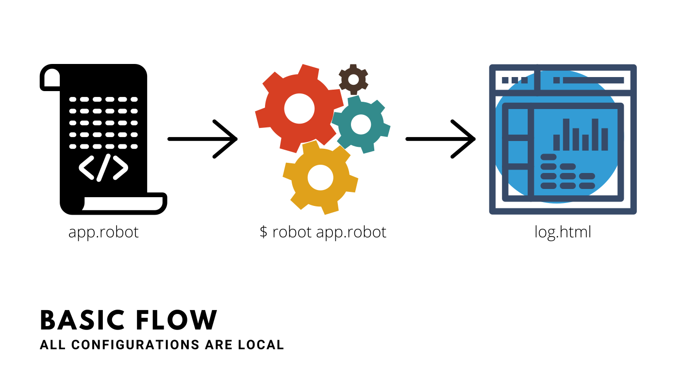
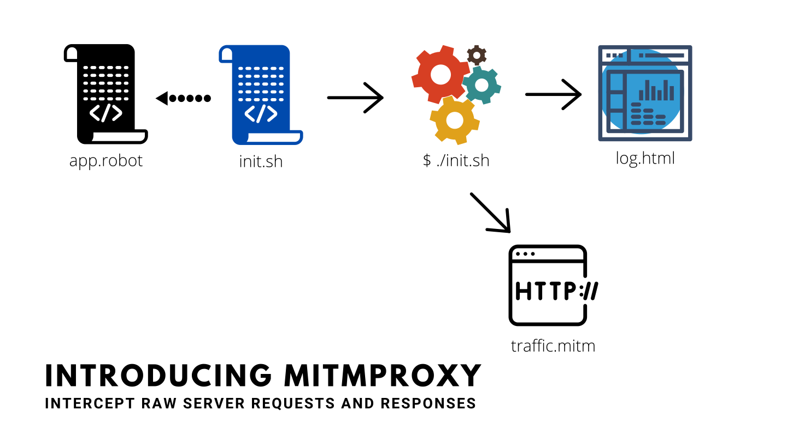
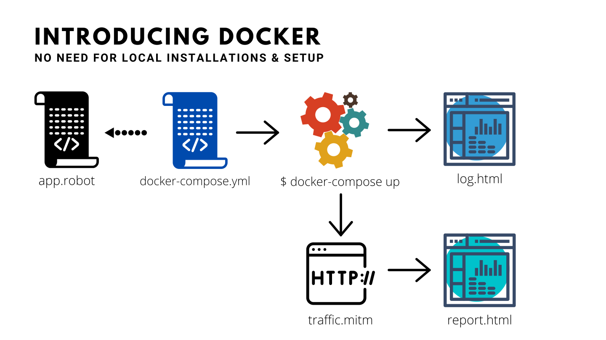
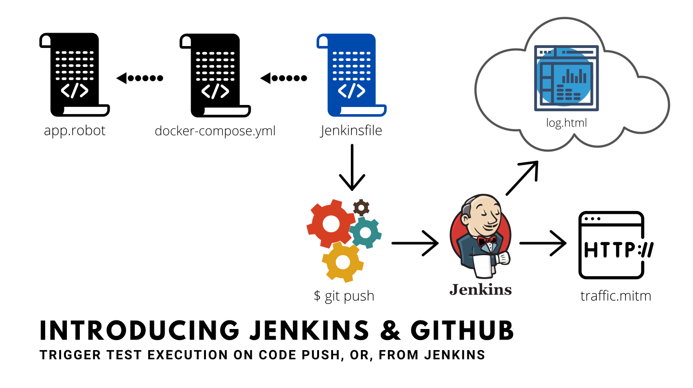

# SecQAtion - Security Tests Automation using Robot Framework

## What are we solving?

While doing a security assessment:
* Get rid of boring manual tasks
* Make your job fun and productive
* Ensure consistency and repeatability
* Generate business friendly test reports
* Let developers incorporate your tests into their build pipeline
* Adapt and evolve, quickly and easily

## Scenario 1:

---

## Scenario 2:

---

## Scenario 3:

---

## Scenario 4:

## Table of Contents

1. [General Understanding of Security Testing Approach](section1/README.md)
2. [OWASP Top 10](section2/README.md)
3. [Inconveniences/Gaps](section3/README.md)
4. [Introduction to Robot Framework](section4/README.md)
5. [Configuring PyCharm](section5/README.md)
6. [Recommended Folder Structure](section6/README.md)
7. [Basic Elements of Robot Framework](section7/README.md)
8. [Exercise: Structured Reconnaisance in <10 min](section8/README.md)
9. [mitmproxy: Intercepting API Requests & Responses](section9/README.md)
10. [Pabot: Parallel Processing](section10/README.md)
11. [Understanding Docker and Docker Compose](section11/README.md)
12. [Dockerizing Selenium Test Execution Environment](section12/README.md)
13. [CI/CD Build Pipeline](section13/README.md)
14. [Serving test report via S3 and CloudFront](section14/README.md)
15. [Implementing authentication via Lamda Edge](section15/README.md)
16. [Leveraging Selenium, Docker, Mitmproxy and HTTPolice]
17. [DVWA: Get Your Hands Dirty](section20/README.md)
18. [Basics of Python programming]
19. [Example: Custom Keywords Library]
20. [Basics of Burp Suite]
