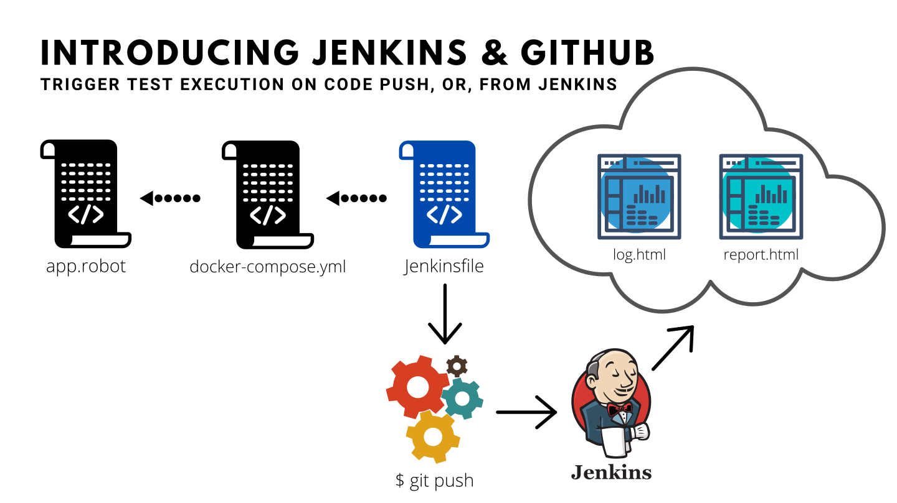

# SecQAtion - Security Tests Automation using Robot Framework

## Table of Contents

1. [General Understanding of Security Testing Approach](section1/README.md)
2. [All About Robot Framework](section2/README.md)
3. [Leveraging Selenium, Docker, Mitmproxy and HTTPolice](section3/README.md)
4. [Leveraging Jenkins, GitHub and AWS](section4/README.md)
5. [Understanding Python and Burp Suite](section5/README.md)
6. [End-to-End Practical Examples](section6/README.md)

## What are we solving?

While doing a security assessment:
* Get rid of boring manual tasks
* Make your job fun and productive
* Ensure consistency and repeatability
* Generate business friendly test reports
* Let developers incorporate your tests into their build pipeline
* Adapt and evolve, quickly and easily

## Scenario 1:

---

## Scenario 2:

---

## Scenario 3:

---

## Scenario 4:

