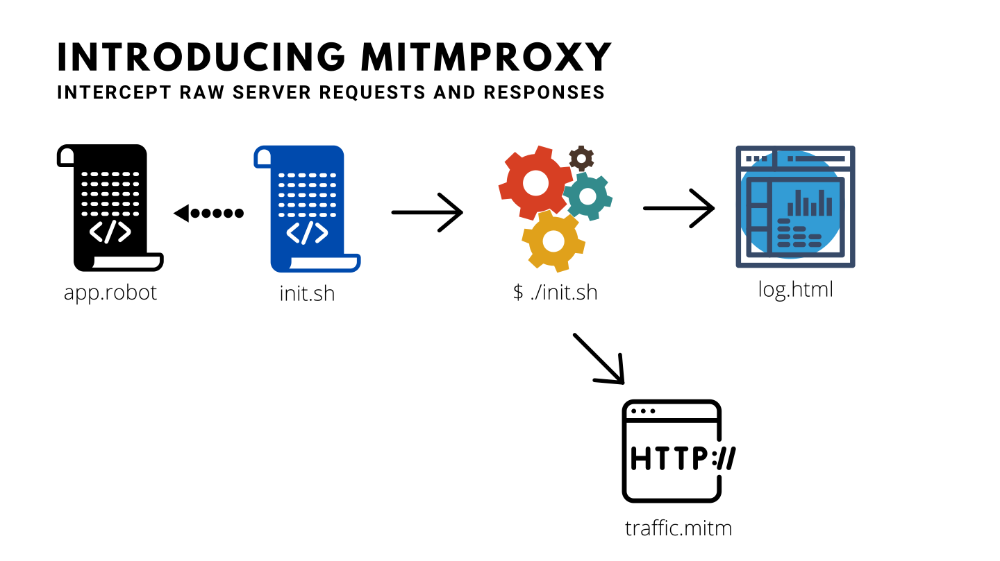

# SecQAtion - Security Tests Automation using Robot Framework

## What are we solving?

* Get rid of boring manual tasks
* Make your job fun and productive
* Ensure consistency and repeatability
* Generate business friendly test report
* Let developers incorporate your tests in their build pipeline

## Scenario 1:

---

## Scenario 2:

---

## Scenario 3:

---

## Scenario 4:

