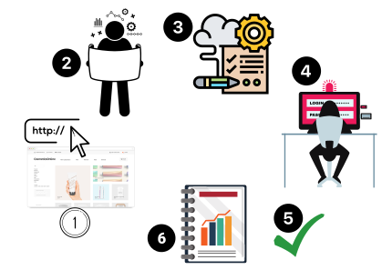
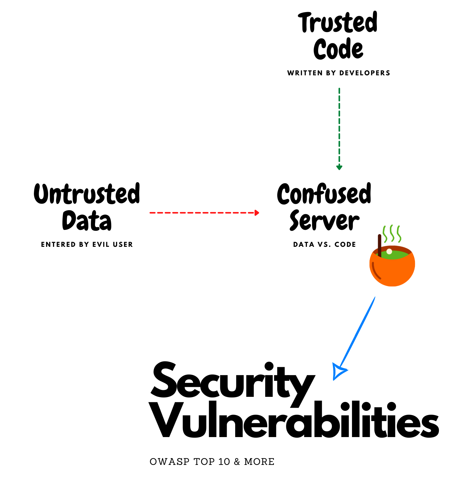
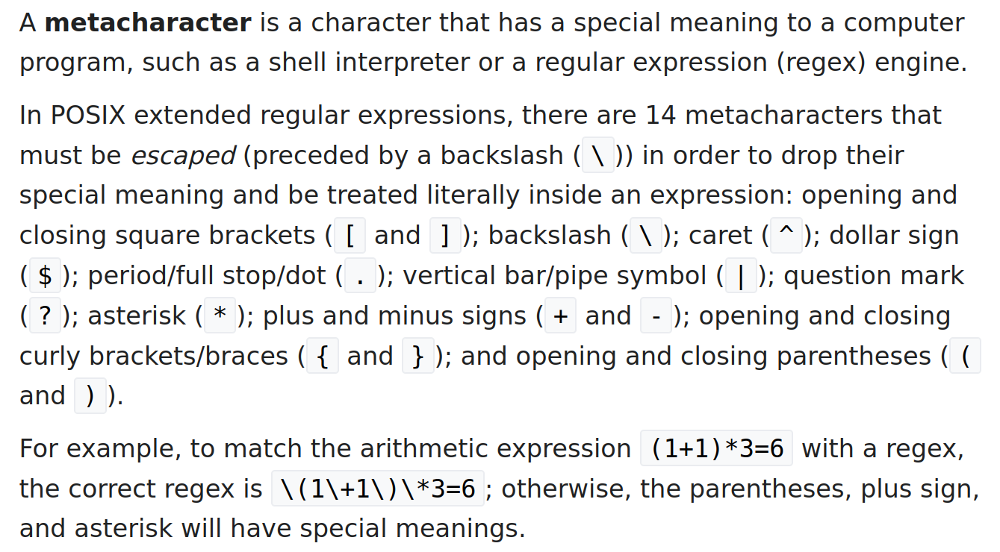

# Standard Security Testing Approach

1. Browse
2. Analyze
3. Prepare
4. Attack
5. Confirm
6. Report

---

## 1. Browse

Browse the target application in its entirety, using valid data, so that no feature is left untouched.

**But, why?**
Let's call this process "reconnaisance".

**What information are we collecting?**
Everything we possibly can. Most importantly, the raw server requests and responses.

* API endpoints
* Request headers
* Response headers
* Request body
* Response body

## 2. Analyze

Identify all entry and exit points.

**What are they?**
An entry point could be any place that accepts user input.
An exit point could be any place in the application that either reflects user input directly, or returns a processed result based upon user-supplied input. 

**How does it help?**
Probably one of these entrypoints is not secure enough. Probably, user can enter arbitrary data that allows confusion at the server. What if due to lack of sufficient user input validation on the server-side, the server confuses user entered data for code that needs to be executed.

The situation could worsen if system manages to dump the unprocessed server responses insecurely in a webpage.

**What information are we collecting?**
Identify target operating system and version, supported programming language, supported server-side technologies, running software versions, etc.

## 3. Prepare

Identify the metacharacter, or, a set of characters that can successfully elicit a "useful" (error) response from the server.

**What are metacharacters?**
According to Wikipedia,

**What are we looking for?**
We are looking for an error response from the server. A server error would indicate a possibility to control the code running on the server via malicious inputs controlled by a low privileged user.

**What shall we prepare?**
Prepare a set of payloads to launch targeted attacks on the server.

## 4. Attack

With entry points identified, vulnerability confirmed via server error response, and payloads prepared, we are ready to lunch an attack on the server.

Take help of cheatsheets to possibly bypass any filters or firewall protection mechanisms.

Research, refine and relaunch the attack until you are satisfied with your findings.

## 5. Confirm

If you think your attack was successful, repeat the steps and confirm its reproducibility.

## 6. Report

Once confirmed, document your findings and share the security report with the concerned team.

# Exercise

1. Go to [defendtheweb.net](https://defendtheweb.net/)
2. Follow the approach explained above (Alloted time: **5 minutes**)
3. Share your findings with us. Explain your approach, any interesting observation, difficulties you faced, issues you found, etc.