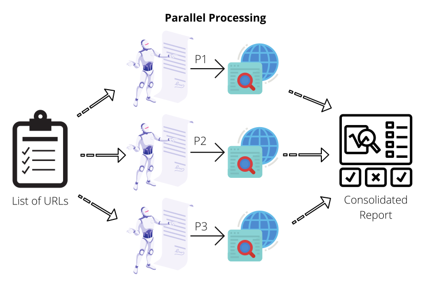

# Pabot: Parallel Processing

## Pabot

It's a parallel executor for Robot Framework tests. Split one execution into multiple and save test execution time.



**Scenario:**

What if we wish to a set of operation across different pages of a website? Shall we scroll through the pages one-by-one, or is there a way to spin up multiple processes that perform same set of tasks but on different endpoints... 

## Installation

Run following command to install Pabot libraries:
```bash
pip install -U robotframework-pabot
```

## Syntax

* By default, two parallel processes would run:

    ```bash
    pabot --pabotlib -d ./OutputFolder/  ./TestSuite/
    ```

* Use `--processes` option to specify specific number of parallel processes that should be run:

    ```bash
    pabot --pabotlib --processes 6 --testlevelsplit -d ./OutputFolder/  ./TestSuite/
    ```

## New Keywords

1. Run Setup Only Once
2. Acquire Lock
3. Release Lock
4. Set Parallel Value For Key
5. Get Parallel Value For Key
6. etc.

## Exercise

1. Add a test step to export all in-scope links, gathered during the crawling process
2. Consider this list of URLs as an input to another set of test cases
3. Start parallel processes such that each process would pick one unique URL from the input list
4. Use `Pabot` to analyze several URLs at the same time, performing same test steps but on different endpoints

## Hint

Check the `DeepCrawl` test suite in `Tests` folder.


1. Access the sample code

    ```bash
    cd /home/secqation/Desktop/NullconTraining2021/2-example
    ```

2. Run following command to trigger parallel test execution

    ```bash
    pabot --pabotlib --processes 6 --testlevelsplit -d Results/ Tests/DeepCrawl/
    ```
    

3. View the execution log by accessing **log.html** in your browser

    `file:///home/secqation/PycharmProjects/secqation/nullcon2021/Results/log.html`

    

4. **Expand keywords** to the see captured data

    

5. Observe changes in the files stored in the Output folder, before and after test execution completes successfully. Explain your observations.

    

6. Also check a modified version of the code at following location: `/home/secqation/Desktop/NullconTraining2021/3-example-pabot/`
