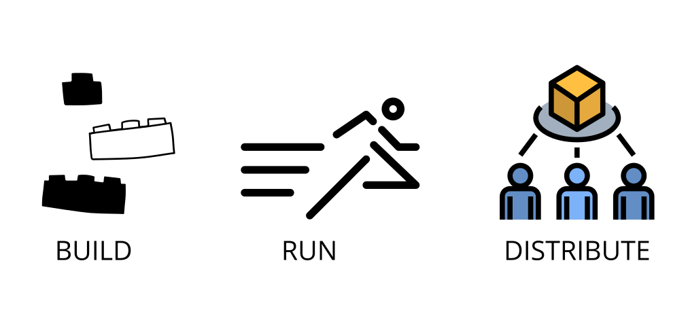
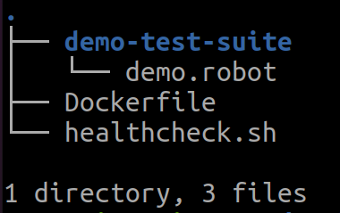
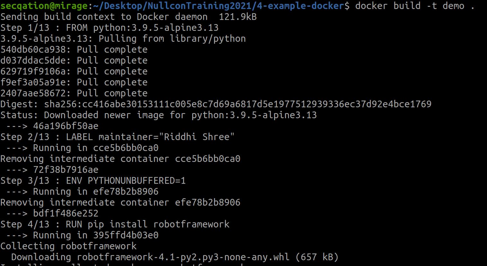
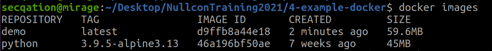
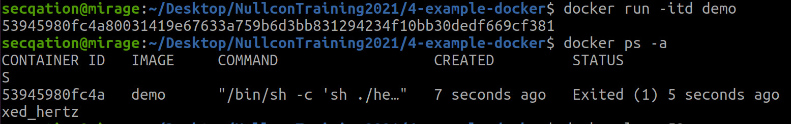
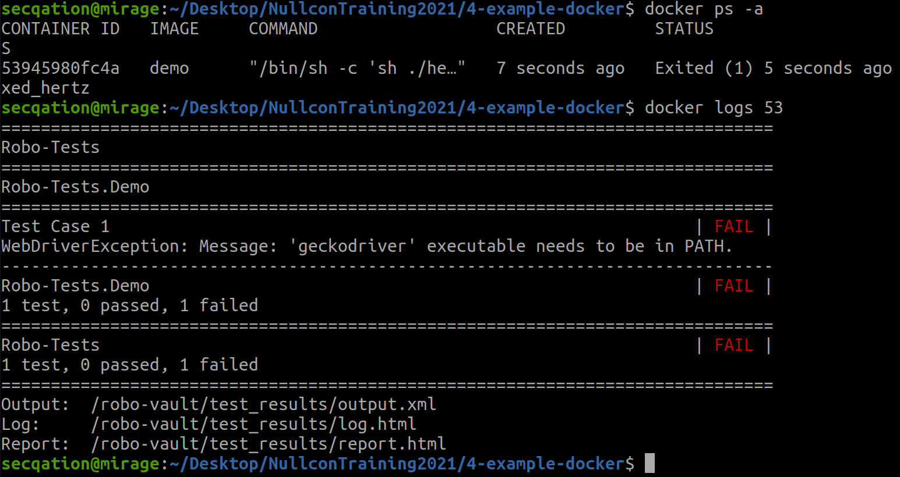
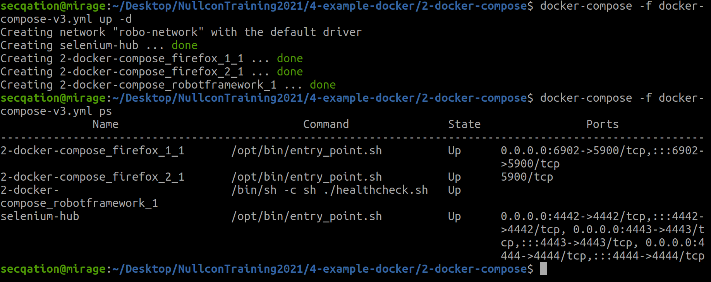
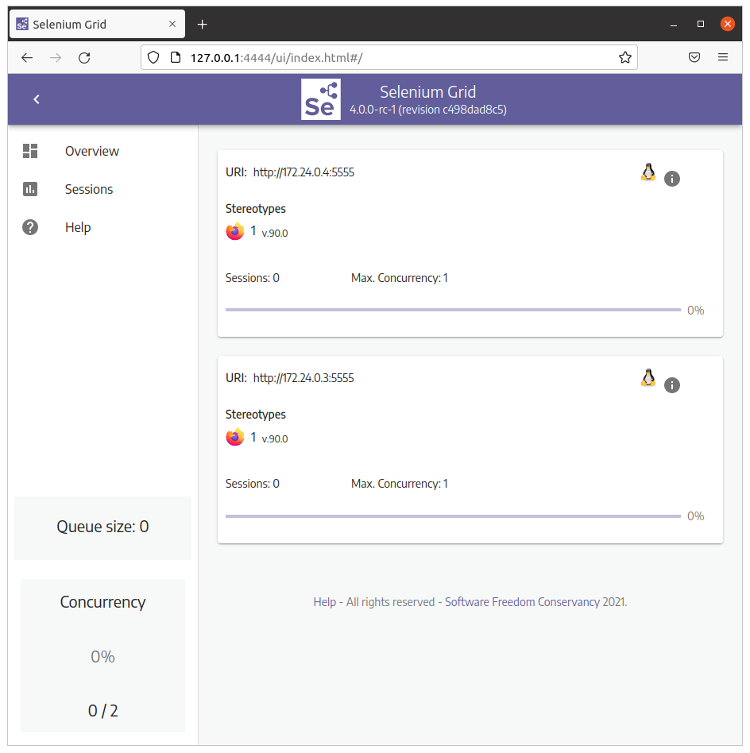
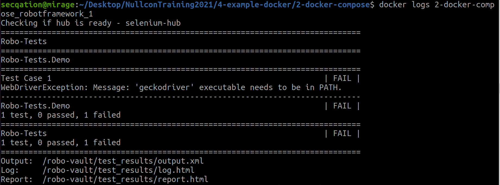

# Understanding Docker and Docker Compose

**Docker** provides the ability to **package and run** **an application** in a loosely isolated environment called a container. The isolation and security allow you to run many containers simultaneously on a given host. Containers are lightweight and contain everything needed to run the application, so you do not need to rely on what is currently installed on the host. You can easily share containers while you work, and be sure that everyone you share with gets the same container that works in the same way.
https://docs.docker.com/get-started/overview/

**Compose** is a tool for **defining and running multi-container Docker applications**. With Compose, you use a YAML file to configure your application’s services. Then, with a single command, you create and start all the services from your configuration. 

[](https://docs.docker.com/get-started/overview/)



## Pre-requisites:

* Install [Docker](https://docs.docker.com/engine/install/)

## 1. Create Dockerfile

1. Create a new file, called **Dockerfile**
2. Paste following contents

    ```Dockerfile
    FROM python:3.9.5-alpine3.13
    LABEL maintainer="Riddhi Shree"

    ENV PYTHONUNBUFFERED=1

    RUN pip install robotframework
    RUN pip install selenium
    RUN pip install robotframework-seleniumlibrary

    WORKDIR /robo-vault/
    RUN mkdir test_results
    VOLUME  /robo-vault/test_results

    ADD ./demo-test-suite  ./robo-tests

    ADD ./healthcheck.sh  ./healthcheck.sh
    RUN chmod +x ./healthcheck.sh

    ENTRYPOINT sh ./healthcheck.sh
    ```
3. Create **healthcheck.sh** file
4. Paste following contents

    ```bash
    #!/usr/bin/env/bash
    robot -d ./test_results  ./robo-tests
    ```
5. Create a folder called **demo-test-suite**

    ```bash
    $ mkdir demo-test-suite
    $ cd demo-test-suite
    ```

6. Inside **demo-test-suite** folder, create **demo.robot** file

    ```bash
    $ touch demo.robot
    ```

7. Paste following code in **demo.robot** file

    ```robot
    *** Settings ***
    Library     SeleniumLibrary

    *** Variables ***
    ${BASE_URL} =  https://www.winja.site

    *** Keywords ***
    Custom keyword
        Log    This is a custom keyword

    *** Test Cases ***
    Test Case 1
        Set Selenium Speed    0
        Open Browser  ${BASE_URL}
        Custom keyword
        Capture Page Screenshot
        Close All Browsers
    ```
8. The final structure should look like this:

    
    *Note:* To access readymade files, check following path: `/home/secqation/Desktop/NullconTraining2021/4-example-docker/1-Dockerfile/`

## 2. Build Docker Image

9. Run following command to build a new Docker image from **Dockerfile**

    ```bash
    $ docker build -t demo .
    ```
    

10. Check if image was created successfully

    ```bash
    $ docker images
    ```
    

## 3. Run Docker Container

11. Start a running container from the Docker image

    ```bash
    $ docker run -itd demo
    $ docker ps -a
    ```
    

12. Read the container **logs**

    ```bash
    $ docker logs <CONTAINER_ID>
    ```
    

13. What did you observe? 
14. The tests have failed. But, why? Can you fix this?

## 4. Create Docker Compose file

15. Download [docker-compose-v3.yml](https://raw.githubusercontent.com/SeleniumHQ/docker-selenium/trunk/docker-compose-v3.yml)

    ```bash
    $ wget https://raw.githubusercontent.com/SeleniumHQ/docker-selenium/trunk/docker-compose-v3.yml
    ```

16. Modify the file as follows

    ```YAML
    version: "3"
    services:
    firefox_1:
        image: selenium/node-firefox:4.0.0-rc-1-prerelease-20210804
        shm_size: 2gb
        depends_on:
        - selenium-hub
        environment:
        - SE_EVENT_BUS_HOST=selenium-hub
        - SE_EVENT_BUS_PUBLISH_PORT=4442
        - SE_EVENT_BUS_SUBSCRIBE_PORT=4443
        ports:
        - "6902:5900"
        volumes:
        - "robo-downloads:/home/seluser/Downloads"
        networks: 
        - robo-network

    firefox_2:
        image: selenium/node-firefox:4.0.0-rc-1-prerelease-20210804
        shm_size: 2gb
        depends_on:
        - selenium-hub
        environment:
        - SE_EVENT_BUS_HOST=selenium-hub
        - SE_EVENT_BUS_PUBLISH_PORT=4442
        - SE_EVENT_BUS_SUBSCRIBE_PORT=4443
        volumes:
        - "robo-downloads:/home/seluser/Downloads"
        networks: 
        - robo-network

    selenium-hub:
        image: selenium/hub:4.0.0-rc-1-prerelease-20210804
        container_name: selenium-hub
        ports:
        - "4442:4442"
        - "4443:4443"
        - "4444:4444"
        volumes:
        - "robo-downloads:/home/seluser/Downloads"
        networks: 
        - robo-network

    robotframework:
        build: .  
        environment:
        - HUB_HOSTNAME=hub
        volumes:
        - "./demo-test-suite:/robo-vault/robo-tests"
        networks:
        - robo-network
        depends_on:
        - firefox_1
        - firefox_2

    volumes:
    robo-downloads:
        name: robo-downloads

    networks: 
    robo-network:
        name: robo-network
    ```

17. Modify the contents of **healthcheck.sh** file as follows

    ```bash
    #!/usr/bin/env/bash

    echo "Checking if hub is ready - $HUB_HOSTNAME"

    while [[ "$(curl -s http://$HUB_HOSTNAME:4444/wd/hub/status | jq .value.ready)" != "true" ]]; do
        sleep 1
    done

    robot -d ./test_results  ./robo-tests
    ```

18. Add following two lines in **Dockerfile**

    ```Dockerfile
    ...
    RUN apk add curl
    RUN curl -OL https://github.com/stedolan/jq/releases/download/jq-1.6/jq-linux64 -o ./jq-linux64 && chmod a+x ./jq-linux64 && mv ./jq-linux64 /usr/bin/jq
    ...
    ```

19. Run following command to start Selenium Hub and to execute robot test cases:

    ```bash
    $ docker-compose build
    $ docker-compose up -d
    $ docker-compose ps
    ```
    

20. **Selenium Grid** dashboard can be accessed at http://127.0.0.1:4444

    

21. Check the logs to see if robot test cases got executed successfully, or not.

    ```bash
    $ docker logs 2-docker-compose_robotframework_1
    ```

        

22. Something is still missing. Let's check what has gone wrong!

## References

* https://docs.docker.com/get-started/overview/
* https://docs.docker.com/compose/
* https://docs.docker.com/compose/install/
* https://hub.docker.com/r/selenium/hub/tags?page=1&ordering=last_updated
* https://raw.githubusercontent.com/SeleniumHQ/docker-selenium/trunk/docker-compose-v3.yml
* https://robotframework.org/SeleniumLibrary/SeleniumLibrary.html
