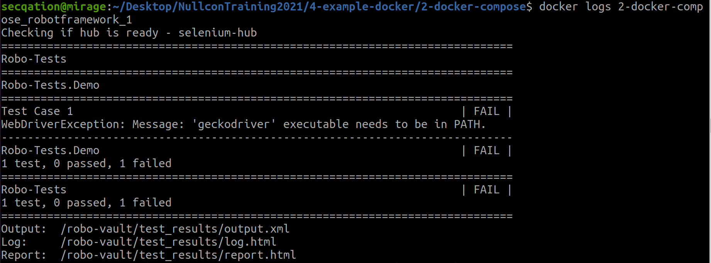
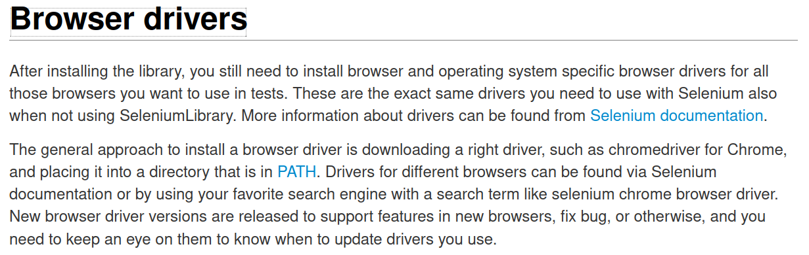
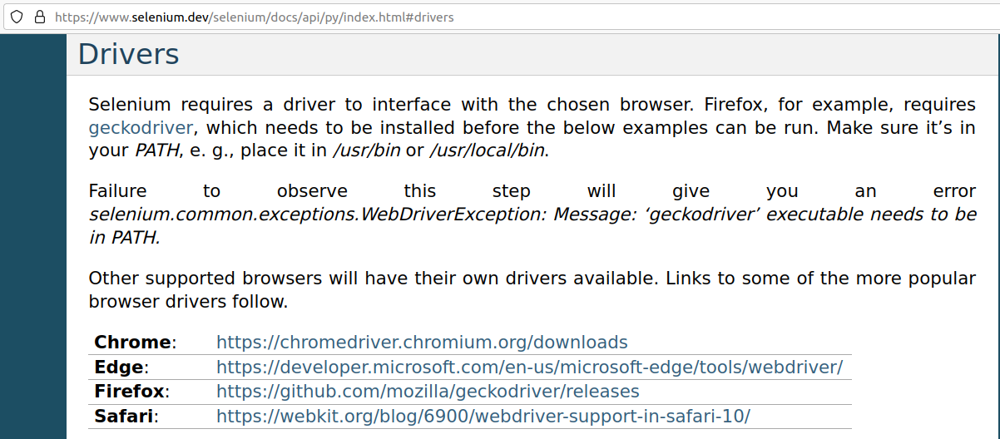
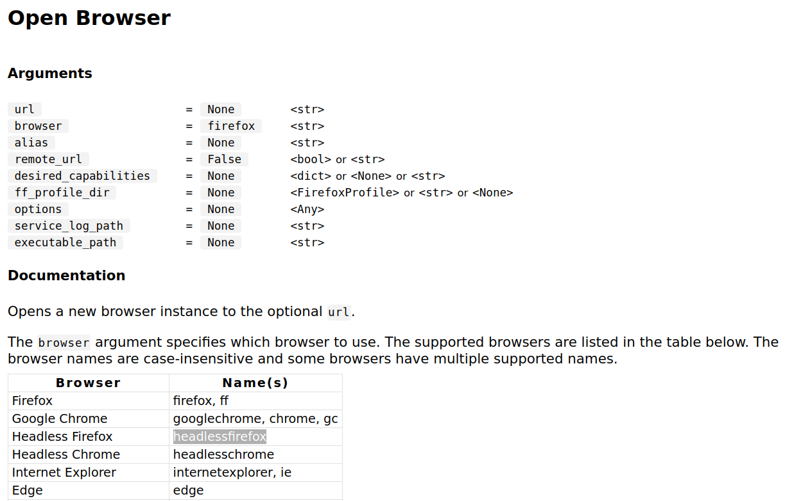
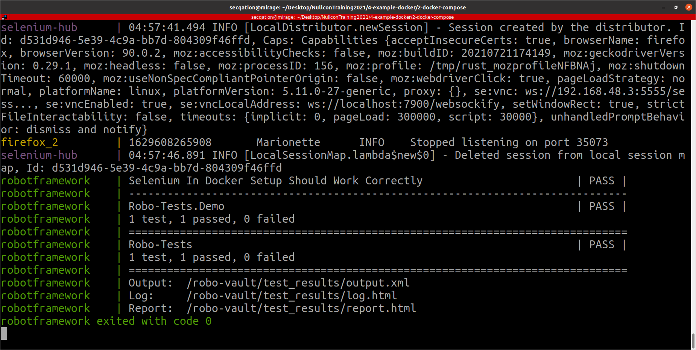
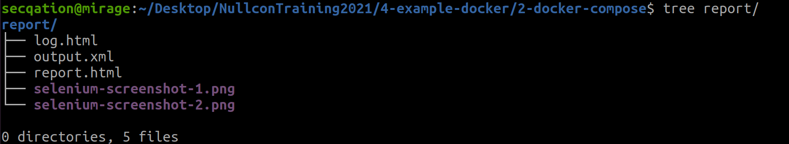
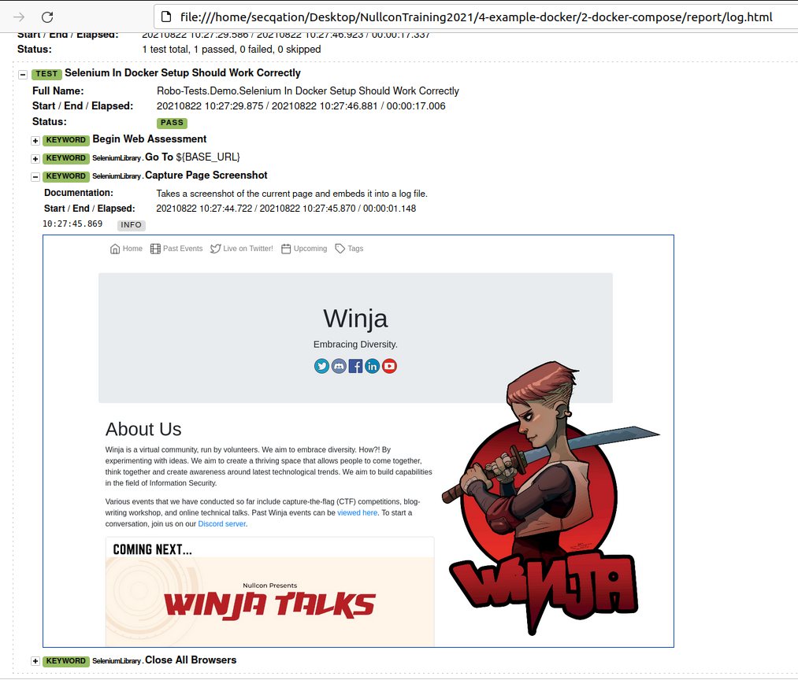

# Dockerizing Selenium Test Execution Environment

## The Problem

So far, we have seen that our **robot test cases are failing** even though we are trying to run them in a Dockerized environment.




On checking the [documentation for SeleniumLibrary](https://robotframework.org/SeleniumLibrary/), we find that all **drivers must be explicitly installed**.

[](https://robotframework.org/SeleniumLibrary/)

Furthermore, on checking the [Selenium documentation](https://www.selenium.dev/selenium/docs/api/py/index.html#drivers), we find an explanation for the exact error that we saw earlier, i.e., `WebDriverException: Message: ‘geckodriver’ executable needs to be in PATH`

[](https://www.selenium.dev/selenium/docs/api/py/index.html#drivers)

Browser drivers can be installed using **webdrivermanager**: 
```bash
$ pip install webdrivermanager
$ webdrivermanager firefox chrome --linkpath /usr/local/bin
```

Under normal circumstances, it would have been required for us to [manually install drivers](https://robotframework.org/SeleniumLibrary/) for any browser that our robot test cases are configured to use.

But, in current situation, as we are consuming the Selenium and Firefox **Docker services**, should we not have everything **preconfigured**?

# Solution: Headless Browser

In our test case, we need to modify the `Open Browser  ${BASE_URL}` test step to open a headless browser, instead.

Check [SeleniumBrowser documentation](https://robotframework.org/SeleniumLibrary/SeleniumLibrary.html) for various **arguments** that can be passed to **Open Browser** keyword.



We can configure a **headless Firefox browser** as shown below:

```robot
...
${firefox_options}=    Evaluate    sys.modules['selenium.webdriver'].FirefoxOptions()    sys, selenium.webdriver
Call Method    ${firefox_options}    add_argument    headless
Call Method    ${firefox_options}    add_argument    disable-gpu
Open Browser   about:blank  browser=headlessfirefox  remote_url=${Selenium_Hub}  desired_capabilities=${firefox_options.to_capabilities()}
...
```

After modification, our files should have following contents:

1. **demo-test-suite/demo.robot**
    ```robot
    *** Settings ***
    Library     SeleniumLibrary

    *** Variables ***
    ${BASE_URL} =  https://www.winja.site
    ${SELENIUM_HUB} =  http://%{HUB_HOSTNAME}:4444/wd/hub
    ${BROWSER} =  headlessfirefox

    *** Keywords ***
    Begin Web Assessment
        ${firefox_options}=    Evaluate    sys.modules['selenium.webdriver'].FirefoxOptions()    sys, selenium.webdriver
        Call Method    ${firefox_options}    add_argument    headless
        Call Method    ${firefox_options}    add_argument    disable-gpu
        Open Browser   about:blank  browser=${Browser}  remote_url=${Selenium_Hub}  desired_capabilities=${firefox_options.to_capabilities()}
        Maximize Browser Window
        Set Selenium Implicit Wait    10 seconds
        Set Selenium Timeout    20 seconds
        Set Selenium Speed    0

    *** Test Cases ***
    Selenium In Docker Setup Should Work Correctly
        Begin Web Assessment
        Go To  ${BASE_URL}
        Capture Page Screenshot
        Close All Browsers
    ```

2. **Dockerfile**
    ```Dockerfile
    FROM python:3.9.5-alpine3.13
    LABEL maintainer="Riddhi Shree"

    ENV PYTHONUNBUFFERED=1

    RUN pip install --upgrade pip

    RUN pip install robotframework
    RUN pip install selenium
    RUN pip install robotframework-seleniumlibrary

    RUN apk add curl
    RUN curl -OL https://github.com/stedolan/jq/releases/download/jq-1.6/jq-linux64 -o ./jq-linux64 && chmod a+x ./jq-linux64 && mv ./jq-linux64 /usr/bin/jq

    WORKDIR /robo-vault/   
    RUN mkdir test_results
    VOLUME	/robo-vault/test_results

    ADD ./demo-test-suite  ./robo-tests

    ADD ./healthcheck.sh  ./healthcheck.sh
    RUN chmod +x ./healthcheck.sh

    ENTRYPOINT sh ./healthcheck.sh
    ```

3. **docker-compose.yml**
    ```YML
    version: "3.9"
    services:
    firefox_1:
        image: selenium/node-firefox:4.0.0-rc-1-prerelease-20210804
        shm_size: 2gb
        container_name: firefox_1
        depends_on:
        - selenium-hub
        environment:
        - SE_EVENT_BUS_HOST=selenium-hub
        - SE_EVENT_BUS_PUBLISH_PORT=4442
        - SE_EVENT_BUS_SUBSCRIBE_PORT=4443
        volumes:
        - "robo-downloads:/home/seluser/Downloads"

    firefox_2:
        image: selenium/node-firefox:4.0.0-rc-1-prerelease-20210804
        shm_size: 2gb
        container_name: firefox_2
        depends_on:
        - selenium-hub
        environment:
        - SE_EVENT_BUS_HOST=selenium-hub
        - SE_EVENT_BUS_PUBLISH_PORT=4442
        - SE_EVENT_BUS_SUBSCRIBE_PORT=4443
        volumes:
        - "robo-downloads:/home/seluser/Downloads"

    selenium-hub:
        image: selenium/hub:4.0.0-rc-1-prerelease-20210804
        container_name: selenium-hub
        ports:
        - "4442:4442"
        - "4443:4443"
        - "4444:4444"
        volumes:
        - "robo-downloads:/home/seluser/Downloads"

    robotframework:
        build: .
        container_name: robotframework
        environment:
        - HUB_HOSTNAME=selenium-hub
        volumes:
        - "./demo-test-suite:/robo-vault/robo-tests"
        - "./report:/robo-vault/test_results"
        depends_on:
        - firefox_1
        - firefox_2

    volumes:
    robo-downloads:
        name: robo-downloads
    ```

4. **healthcheck.sh**
    ```bash
    #!/usr/bin/env/bash

    echo "Checking if hub is ready - $HUB_HOSTNAME"

    while [[ "$(curl -s http://$HUB_HOSTNAME:4444/wd/hub/status | jq .value.ready)" != "true" ]]; do
        sleep 1
    done

    robot -d ./test_results  ./robo-tests
    ```

## Test Execution

1. Run following commands to execute robot test cases in a headless Firefox browser, inside a Docker network:

    ```bash
    $ docker-compose build
    $ docker-compose up
    ```

    

2. A new folder called **report** must have been created in the working directory. This folder contains the test report that was auto-generated by the robot framework.

    

3. Open **log.html** file in a browser to view the test logs

    

## References

* https://robotframework.org/SeleniumLibrary/
* https://www.selenium.dev/selenium/docs/api/py/index.html#drivers
* https://github.com/rasjani/webdrivermanager
* https://robotframework.org/SeleniumLibrary/SeleniumLibrary.html
