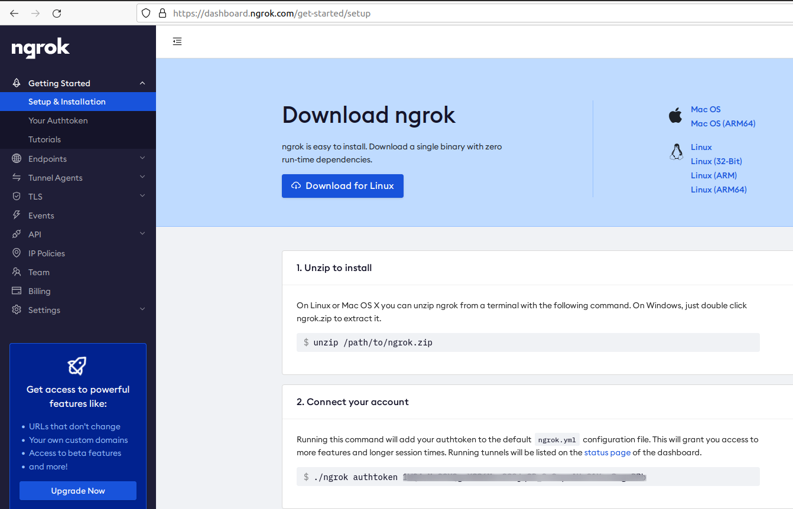
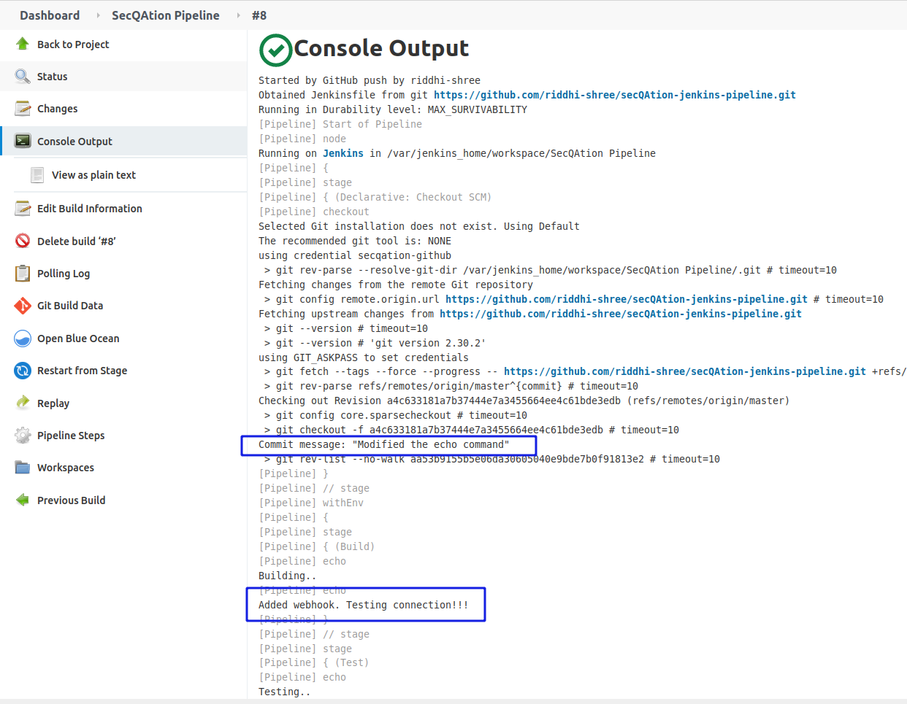

# CI/CD Build Pipeline

## Git

1. Create a new Git repository in [github.com](https://github.com/)

    

2. Create a new directory locally, and run the setup commands

    ```bash
    $ git init
    $ git remote add origin git@github.com:riddhi-shree/secQAtion-jenkins-pipeline.git
    ```

## Personal Access Token

3. Login to github.com
4. Go to **Settings** > **Developer settings** > **Personal access tokens**
5. Click on **Generate new token** button

    

6. Enter a descriptive text in **Note** input field, to uniquely identify the token
7. Select **repo** checkbox
8. Click on **Generate token** button
9. Copy the generated personal access token value, and use this secret to access GitHub repository from Jenkins

## Jenkinsfile

10. Create a file called **Jenkinsfile**
11. Add following contents

    ```Ruby
    pipeline {
        agent any

        stages {
            stage('Build') {
                steps {
                    echo 'Building..'
                }
            }
            stage('Test') {
                steps {
                    echo 'Testing..'
                }
            }
            stage('Deploy') {
                steps {
                    echo 'Deploying....'
                }
            }
        }
    }
    ```

## Jenkins Server

12. In a separate folder, create a **Dockerfile** with following contents

    ```Dockerfile
    FROM jenkins/jenkins:lts
    USER root

    RUN mkdir -p /tmp/download && \
    curl -L https://download.docker.com/linux/static/stable/x86_64/docker-18.03.1-ce.tgz | tar -xz -C /tmp/download && \
    rm -rf /tmp/download/docker/dockerd && \
    mv /tmp/download/docker/docker* /usr/local/bin/ && \
    rm -rf /tmp/download && \
    groupadd -g 133 docker && \
    usermod -aG staff,docker jenkins

    USER jenkins
    ```

13. Build Jenkins Docker image

    ```bash
    docker build -t jenkins-docker .
    ```

14. Run following commands to successfully start the Jenkins server

    ```bash
    $ mkdir -p /var/jenkins_home
    $ chown -R 1000:1000 /var/jenkins_home/
    $ docker run -p 8080:8080 -p 50000:50000 -v /var/jenkins_home:/var/jenkins_home -v /var/run/docker.sock:/var/run/docker.sock --name jenkins -d jenkins-docker
    ```

    

15. Navigate to http://localhost:8080/

    

16. Click on **New Item** option in left navigation menu
17. Enter an item name, e.g., `SecQAtion`
18. Select **Pipeline** option, and click **OK**

    
19. Scroll down to **Advanced Project Options** > **Pipeline**
20. Select `Pipeline script from SCM` option in **Definition** dropdown list

    
21. From **SCM** dropdown, select `Git` option
22. Enter your Git repository URL, e.g., `https://github.com/riddhi-shree/secQAtion-jenkins-pipeline.git`

    
23. Select **Credentials** > **Add** > **Jenkins**
24. Enter GitHub username
25. Enter your GitHub **Personal Access Token** in **Password** field
26. Enter a unique name in **ID** field, e.g. `secqation-github`
    
    

27. Validate **Script Path** that specifies path to the **Jenkinsfile** in GitHub repository
28. Uncheck **Lightweight checkout** checkbox

    

29. Click on **Apply** button
30. Click on **Save** button

    

## ngrok

1. Download [ngrok](https://ngrok.com/download)
2. Unzip ngrok

    ```bash
    unzip /path/to/ngrok.zip
    ```
3. Sign up and login to [ngrok dashboard](https://dashboard.ngrok.com/login)

    

4. Copy your [authtoken](https://dashboard.ngrok.com/get-started/setup)
5. Connect your account

    ```bash
    ./ngrok authtoken <your_auth_token>
    ```
6. Start a HTTP tunnel forwarding to your local port 8080 (where Jenkins server is running)

    ```bash
    ./ngrok http 8080
    ```
    
7. Take a note of the **forwarding URL**, e.g., `http://ff2d-49-37-75-29.ngrok.io`

    
    
## Webhook

1. Login to your [GitHub](https://github.com/) account
2. Go to the project repository
3. Click on **Settings** > **Webhooks** > **Add webhook**
4. Enter payload URL, e.g. `http://ff2d-49-37-75-29.ngrok.io/github-webhook`

    
    *Note:* Appending the URL path `/github-webhook` to ngrok forwarding URL (e.g., `http://ff2d-49-37-75-29.ngrok.io`) will give us the **Payload URL** for GitHub webhook
5. Optionally, enter a **Secret**
6. Select **Just the push event** option
7. Click on **Add webhook** button
    
    

## Configure Build Trigger

1. Login to Jenkins server
2. Select your pipeline from the Dashboard

    

3. Click on **Configure** > **Build Triggers**
4. Select the option **GitHub hook trigger for GITScm polling**
   
    
5. Click on **Save** button

## Git Commit

1. Open a terminal and navigate to your local Git repository

    ```bash
    cd /home/secqation/Desktop/NullconTraining2021/6-example-jenkins
    ```

2. Modify the **echo** command in **Jenkinsfile** (just for testing purpose)

    ```ruby
    pipeline {
        agent any

        stages {
            stage('Build') {
                steps {
                    echo 'Building..'
                    echo 'Added webhook. Testing connection!!!'
                }
            }
            stage('Test') {
                steps {
                    echo 'Testing..'
                }
            }
            stage('Deploy') {
                steps {
                    echo 'Deploying....'
                }
            }
        }
    }
    ```
3. Push the changes to remote GitHub repository

    ```bash
    $ git add .
    $ git status
    $ git commit -m "Your comment"
    $ git push
    ```

    

4. Notice that a new build is triggered automatically

    

5. Click on the **build number**
6. Click on **Console Output**

    
    

## Triggering Robot Test Case Execution

We can now succesfully trigger a build in Jenkins for every `git push` event in GitHub.  So, what's pending then? We are yet to execute the automated test cases and fetch test results.

The final **folder structure** of our Git repository might look similar to following:


Let's confirm the contents of each file at this point.

### demo.robot

```robot
*** Settings ***
Library     SeleniumLibrary

*** Variables ***
${BASE_URL} =  https://www.winja.site
${SELENIUM_HUB} =  http://%{HUB_HOSTNAME}:4444/wd/hub
${BROWSER} =  headlessfirefox

*** Keywords ***
Begin Web Assessment
    ${firefox_options}=    Evaluate    sys.modules['selenium.webdriver'].FirefoxOptions()    sys, selenium.webdriver
    Call Method    ${firefox_options}    add_argument    headless
    Call Method    ${firefox_options}    add_argument    disable-gpu
    Open Browser   about:blank  browser=${Browser}  remote_url=${Selenium_Hub}  desired_capabilities=${firefox_options.to_capabilities()}
    Maximize Browser Window
    Set Selenium Implicit Wait    10 seconds
    Set Selenium Timeout    20 seconds
    Set Selenium Speed    0

*** Test Cases ***
Selenium In Docker Setup Should Work Correctly
    Begin Web Assessment
    Go To  ${BASE_URL}
    Capture Page Screenshot
    Close All Browsers
```

### docker-compose.yml

```yaml
version: "3.9"
services:
  firefox_1:
    image: selenium/node-firefox:4.0.0-rc-1-prerelease-20210804
    shm_size: 2gb
    container_name: firefox_1
    depends_on:
      - selenium-hub
    environment:
      - SE_EVENT_BUS_HOST=selenium-hub
      - SE_EVENT_BUS_PUBLISH_PORT=4442
      - SE_EVENT_BUS_SUBSCRIBE_PORT=4443
    volumes:
      - "robo-downloads:/home/seluser/Downloads"

  firefox_2:
    image: selenium/node-firefox:4.0.0-rc-1-prerelease-20210804
    shm_size: 2gb
    container_name: firefox_2
    depends_on:
      - selenium-hub
    environment:
      - SE_EVENT_BUS_HOST=selenium-hub
      - SE_EVENT_BUS_PUBLISH_PORT=4442
      - SE_EVENT_BUS_SUBSCRIBE_PORT=4443
    volumes:
      - "robo-downloads:/home/seluser/Downloads"

  selenium-hub:
    image: selenium/hub:4.0.0-rc-1-prerelease-20210804
    container_name: selenium-hub
    ports:
      - "4442:4442"
      - "4443:4443"
      - "4444:4444"
    volumes:
      - "robo-downloads:/home/seluser/Downloads"

  robotframework:
    build: .
    container_name: robotframework
    environment:
      - HUB_HOSTNAME=selenium-hub
    volumes:
      - "./demo-test-suite:/robo-vault/robo-tests"
      - "./report:/robo-vault/test_results"
    depends_on:
      - firefox_1
      - firefox_2

volumes:
  robo-downloads:
    name: robo-downloads
```

### Dockerfile

```bash
FROM python:3.9.5-alpine3.13
LABEL maintainer="Riddhi Shree"

ENV PYTHONUNBUFFERED=1

RUN pip install --upgrade pip

RUN pip install robotframework
RUN pip install selenium
RUN pip install robotframework-seleniumlibrary

RUN apk add curl
RUN curl -OL https://github.com/stedolan/jq/releases/download/jq-1.6/jq-linux64 -o ./jq-linux64 && chmod a+x ./jq-linux64 && mv ./jq-linux64 /usr/bin/jq

RUN pip install -U robotframework-pabot
RUN pip install robotframework-requests bs4 tldextract

WORKDIR /robo-vault/   
RUN mkdir test_results
VOLUME	/robo-vault/test_results

ADD ./demo-test-suite  ./robo-tests

ADD ./healthcheck.sh  ./healthcheck.sh
RUN chmod +x ./healthcheck.sh

ENTRYPOINT sh ./healthcheck.sh
```

### healthcheck.sh

```bash
#!/usr/bin/env/bash

echo "Checking if hub is ready - $HUB_HOSTNAME"

while [[ "$(curl -s http://$HUB_HOSTNAME:4444/wd/hub/status | jq .value.ready)" != "true" ]]; do
    sleep 1
done

robot -d ./test_results  ./robo-tests
```

### init.sh

```bash
docker-compose down
docker rm `docker ps -aq`
docker-compose build
docker-compose up -d

condition=`docker ps -q --no-trunc | grep $(docker-compose ps -q robotframework)`

while [ -z $condition ]
    do
        sleep 2s
	condition=`docker ps -q --no-trunc | grep $(docker-compose ps -q robotframework)`
	#echo $condition
    done

echo "Test execution in-progress..."
container_id=$condition

condition=`docker ps -q --no-trunc | grep $(docker-compose ps -q robotframework)`
while [ $condition ]
    do
        sleep 2s
        condition=`docker ps -q --no-trunc | grep $(docker-compose ps -q robotframework)`
	#echo $condition
    done

docker logs $container_id
docker cp $container_id:/robo-vault/test_results ./ROBOT_TEST_RESULTS

docker-compose down
```

### Jenkinsfile

```bash
pipeline {
    agent any

    stages {
        stage('Test Execution') {
            steps {
		sh 'rm -r ./ROBOT_TEST_RESULTS'
		sh './init.sh'
            }
        }
        stage('Publish Test Output') {
            steps {
                echo 'S3 and Cloudfront'
		sh 'pwd; rm ./ROBOT_TEST_RESULTS/geckodriver*; ls -la; ls -la ./ROBOT_TEST_RESULTS'
            }
        }
    }
}
```

### View Build Output

Once a new commit is pushed to remote **GitHub** repository, a build is triggered in Jenkins server. Steps mentioned in **Jenkinsfile** get executed.


**Note:** To run this example yourself, look at the code available at location `/home/secqation/Desktop/NullconTraining2021/6-example-jenkins`

## What's next?
How do we view the detailed test results...

## References

* https://blog.knoldus.com/opsinit-adding-a-github-webhook-in-jenkins-pipeline/
* https://github.com/
* https://ngrok.com/download
* https://dashboard.ngrok.com/login
* https://dashboard.ngrok.com/get-started/setup
