# Serving test report via S3 and CloudFront


## Steps

1. Purchase a **domain name** (e.g., `secqation.xyz`)

    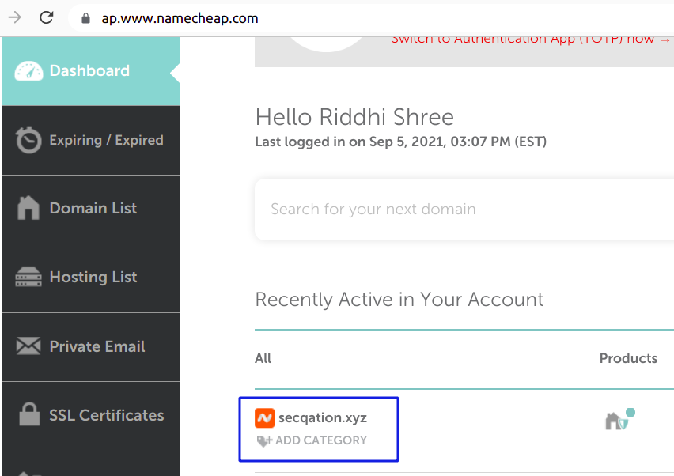

2. Create a private S3 bucket, having same name as the purchased domain name (i.e., `secqation.xyz`)

    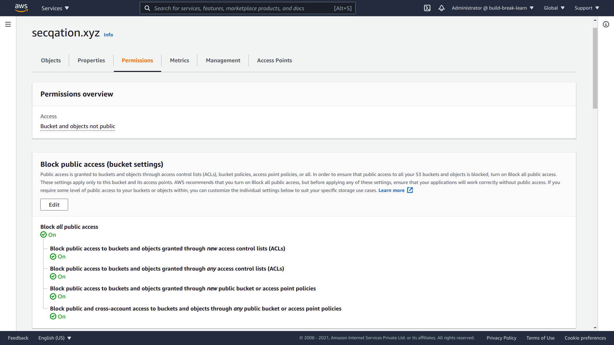

3. Create an **IAM user** having permission to upload files to S3 bucket

    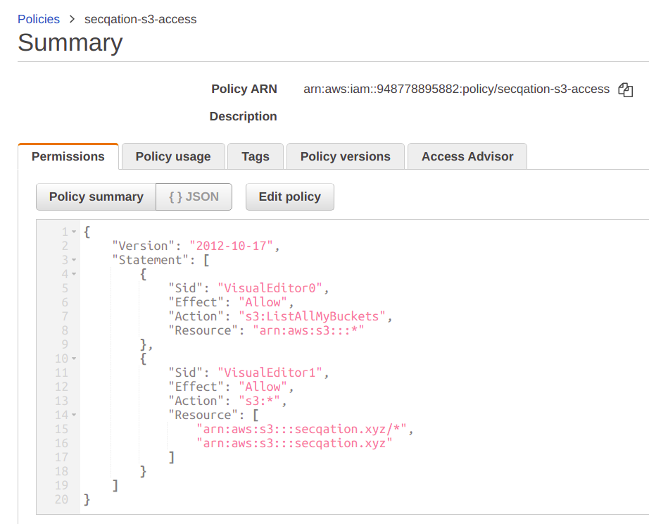

## CloudFront

4. Login to AWS account
5. Got to [CloudFront console](https://console.aws.amazon.com/cloudfront/v3/home?#/distributions)
6. Click on **Create Distribution** button
7. Fill the [create distribution form](https://console.aws.amazon.com/cloudfront/v3/home?#/distributions/create):
   1.  *Origin Domain*: Choose your **S3 bucket** from dropdown list
   2.  *S3 bucket access*: Select 
   **Yes use OAI (bucket can restrict access to only CloudFront)**
   3. Click on **Create new OAI** > **Create**
   4. *Bucket policy*: Select 
   **Yes, update the bucket policy**

        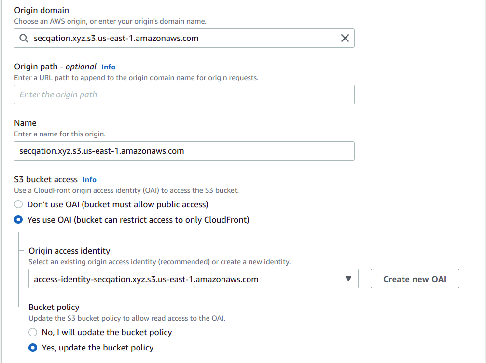

   5. *Viewer protocol policy*: Select 
   **Redirect HTTP to HTTPS**
   6. *Allowed HTTP methods*: Select 
   **GET, HEAD**
   7. Scroll down to "Settings" and select an option (e.g., **Use North America, Europe, Asia, Middle East, and Africa**)
   8.  Select **Alternate domain name (CNAME)** > **Add item**, and enter target domain name (e.g., `secqation.xyz`)
   9.  Select **Custom SSL certificate** > **Request certificate**

        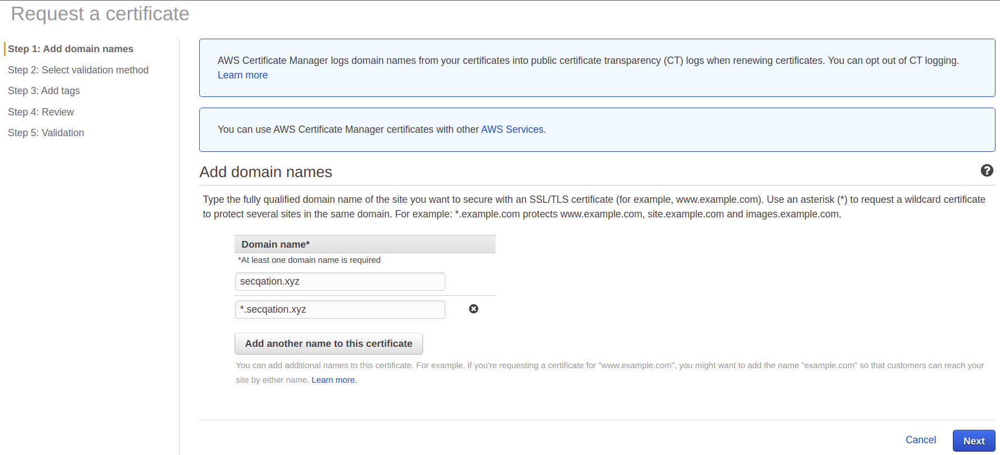

   10. Fill and submit the "Request a certificate" form
   11. Return to "Create distribution" form
   12. In the **Custom SSL certificate** dropdown field, select the cetificate that was just created.

        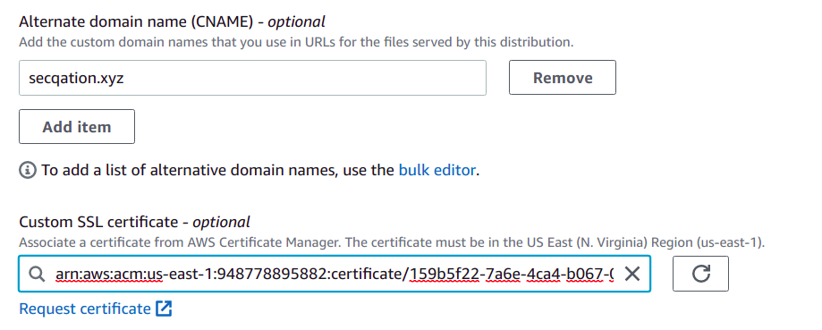

   13. Click on **Create Distribution** button
   14. Wait until the CloudFront distribution creation status becomes **Enabled**

        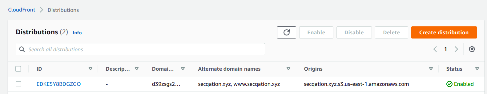

## Hosted Zone

1. When a certificate is issued for a domain, user is required to add a CNAME record to their domain to prove the domain ownership.

    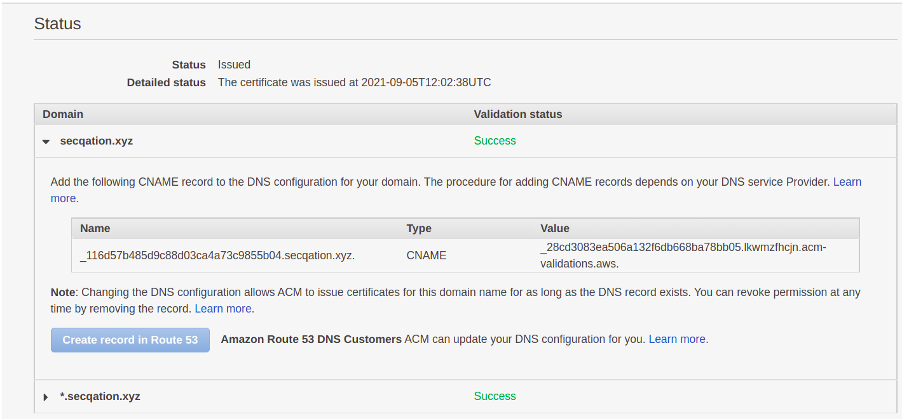

2. After the CNAME record is added successfully to the domain, it takes a while to update the DNS validation status in AWS. Wait until the "Validation status" shows as **Success**, and certificate status shows as **Issued**.

    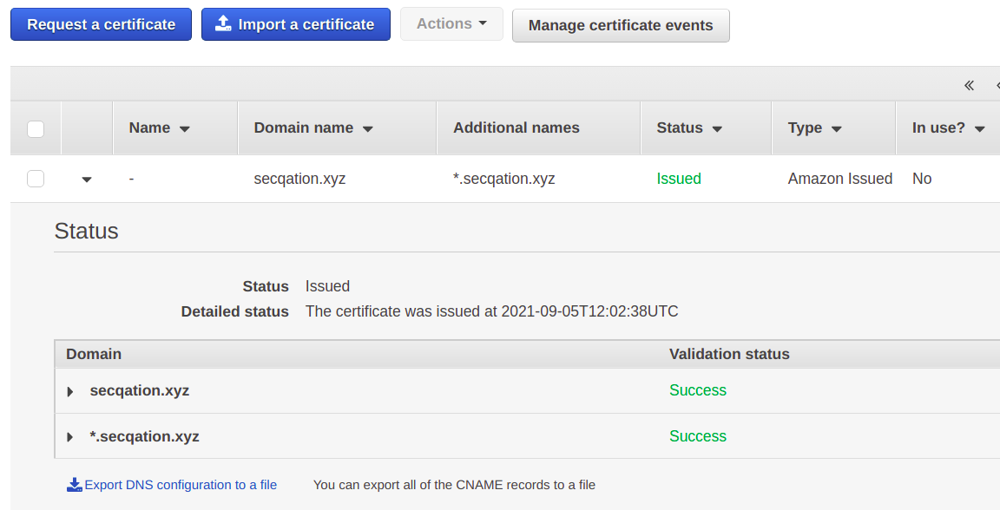

3. Go to [Route 53 dashboard](https://console.aws.amazon.com/route53/v2/home#Dashboard)
4. Click on **Hosted zones** > **Create hosted zone**
5. Enter **Domain name**, e.g., `secqation.xyz`

    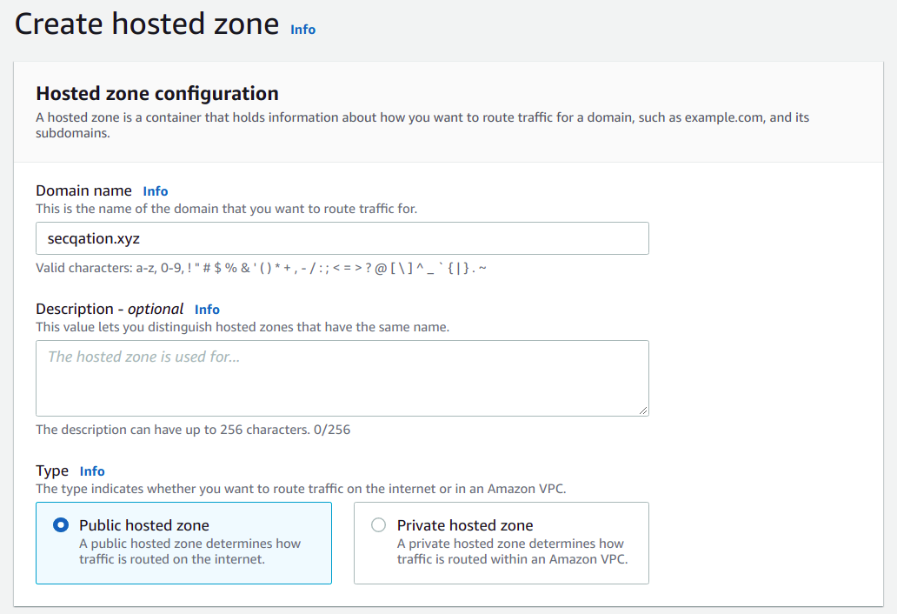

6. Click on **Create hosted zone** button
7. You will be displayed with a list of **AWS nameservers**.

    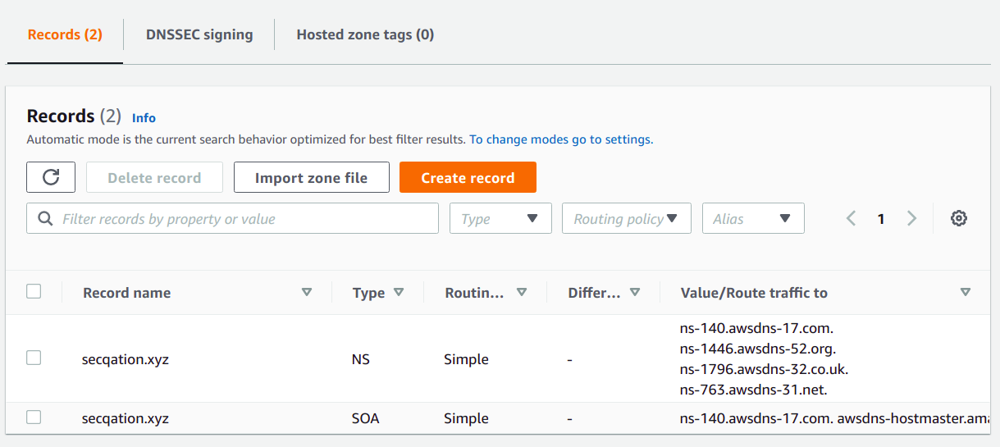

8. Change your domain's default nameserver to these **external nameservers**.
9. Wait until the nameservers are updated successfully for your domain. Check the status by running following command:

    ```bash
    dig NS secqation.xyz
    ```

10. Add records in your hosted zone to redirect a user to the CloudFront endpoint, that would fetch website contents from an S3 bucket
11. Click on **Create record** button
12. Leave **Record name** as empty
13. Switch on the **Alias** option
14. In "Route traffic to" dropdown list, select **Alias to CloudFront distribution**

    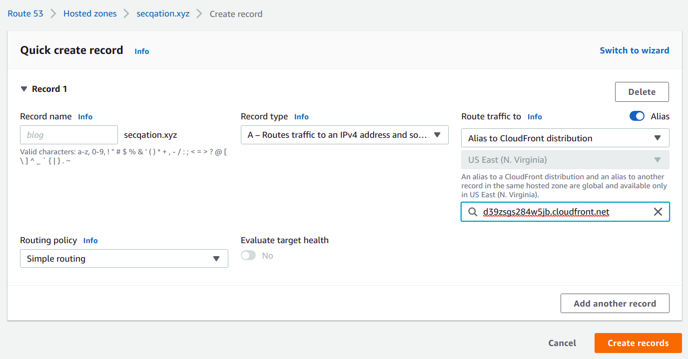

15. Select the appropriate CloudFront distribution endpoint
16. Click on **Add another record** button
17. In the **Record name** field, enter `www`
18. In "Route traffic to" dropdown list, select **Alias to another record in this hosted zone**
19. Select the record that was just created, i.e. `secation.xyz.`

    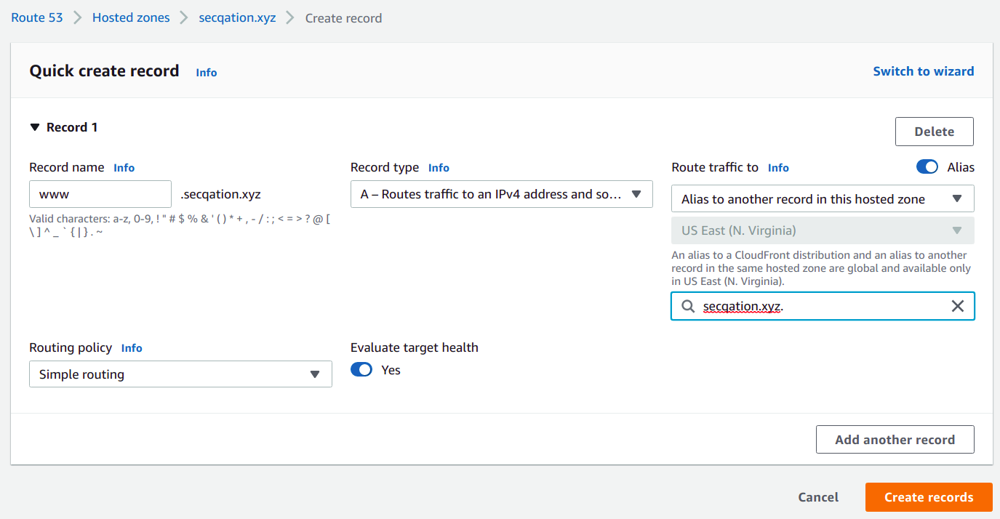

20. Click on **Create records** button

    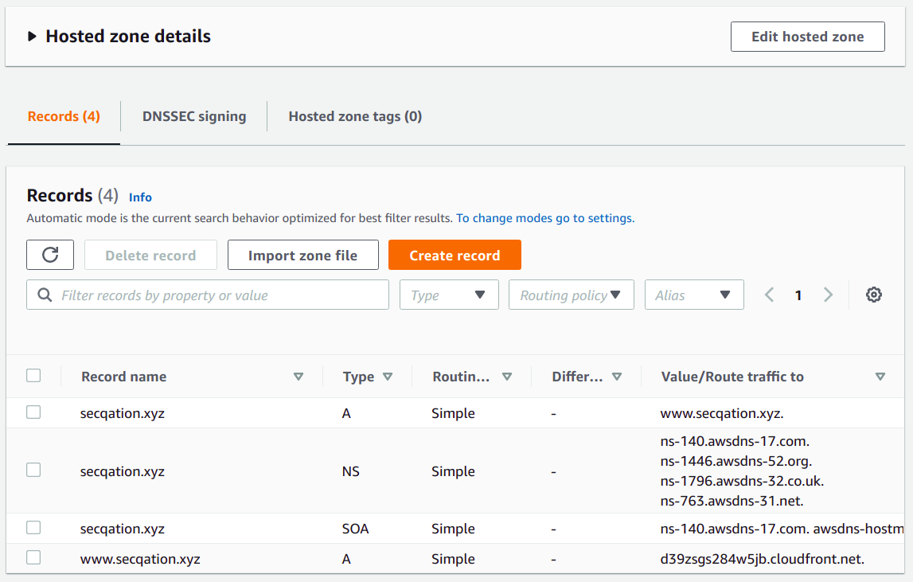

21. Open a browser window and enter your domain name to access the static website hosted on S3 bucket

    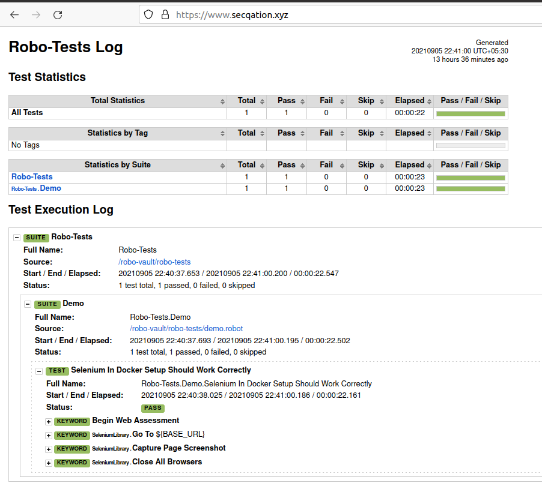

## S3 Bucket: Content Update

### AWS Vault

AWS Vault is a tool to securely store and access AWS credentials in a development environment. AWS Vault stores IAM credentials in your operating system's secure keystore and then generates **temporary credentials** from those to expose to your shell and applications.

1. Download **aws-vault** [binary](https://github.com/99designs/aws-vault/releases/download/v6.3.1/aws-vault-linux-amd64)

    ```bash
    $ wget https://github.com/99designs/aws-vault/releases/download/v6.3.1/aws-vault-linux-amd64
    $ chmod +x aws-vault-linux-amd64
    $ mv aws-vault-linux-amd64 /usr/bin/aws-vault
    $ aws-vault --help
    ```

2. Create a new AWS **profile**, and save your IAM credentials securely

    ```bash
    aws-vault add secqation
    ```

    

3. **Execute** a command (using temporary credentials)

    ```bash
    aws-vault exec secqation -- aws s3 ls
    ```

4. **Authenticate** with your AWS IAM account

    ```bash
    aws-vault exec --duration=12h secqation
    ```
    *Note:* This should set your AWS credentials in your current Terminal session.

5. **View** the temporary AWS credentials

    ```bash
    aws-vault exec secqation -- env | grep AWS
    ```

### AWS CLI

* Single file upload

    ```bash
    aws s3 cp ./index.html s3://amazon-cloudfront-secure-static-site-s3bucketroot-9z7rxapslwau
    ```

* Multiple files upload

    ```bash
    aws s3 cp ./test-suite/ s3://amazon-cloudfront-secure-static-site-s3bucketroot-9z7rxapslwau/ --recursive
    ```

## CloudFront: Caching Policy Update

If changes are not reflecting on your website, [invalidate](https://docs.aws.amazon.com/AmazonCloudFront/latest/DeveloperGuide/Invalidation.html#invalidation-specifying-objects-paths) the cached files, and update the chaching policy.

1. Go to **CloudFront** console
2. Select your distribution
3. Select **Behaviors** tab
4. **Edit** behavior
5. In **Edit Behavior** screen, scroll down to **Cache key and origin requests** section
6. Choose **Legacy cache settings**
7. Under **Object caching** section, choose **Customize**
8. For **Minimum TTL**, enter `0`
9. For **Maximum TTL**, enter `1`
10. For **Default TTL**, enter `1`

*Note:* After this update, your website will instantaneously reflect any changes made to the files stored in S3 bucket.

## Update Dockerfile for Jenkins server

1. Add steps to install 4 new packages, namely [aws-vault](https://github.com/99designs/aws-vault), [pass](https://www.passwordstore.org/), [GnuPG](https://access.redhat.com/documentation/en-us/red_hat_enterprise_linux/6/html/security_guide/sect-security_guide-encryption-gpg-creating_gpg_keys_using_the_command_line) and [AWS CLI](https://docs.aws.amazon.com/cli/latest/userguide/install-cliv2-linux.html) on our Jenkins server. These packages would help us in uploading files to S3 bucket in a secure manner. 

    ```Dockerfile
    FROM jenkins/jenkins:lts
    USER root

    RUN mkdir -p /tmp/download && \
    curl -L https://download.docker.com/linux/static/stable/x86_64/docker-18.03.1-ce.tgz | tar -xz -C /tmp/download && \
    rm -rf /tmp/download/docker/dockerd && \
    mv /tmp/download/docker/docker* /usr/local/bin/ && \
    rm -rf /tmp/download && \
    groupadd -g 133 docker && \
    usermod -aG staff,docker jenkins

    RUN curl -L "https://github.com/docker/compose/releases/download/1.29.2/docker-compose-$(uname -s)-$(uname -m)" -o /usr/local/bin/docker-compose
    RUN chmod +x /usr/local/bin/docker-compose
    RUN ln -s /usr/local/bin/docker-compose /usr/bin/docker-compose

    RUN apt-get update \
    && apt-get install -y wget
    RUN wget https://github.com/99designs/aws-vault/releases/download/v6.3.1/aws-vault-linux-amd64
    RUN chmod +x aws-vault-linux-amd64
    RUN mv aws-vault-linux-amd64 /usr/bin/aws-vault

    RUN apt-get install -y pass gnupg2

    WORKDIR /home
    COPY gpg.txt gpg.txt

    RUN curl "https://awscli.amazonaws.com/awscli-exe-linux-x86_64.zip" -o "awscliv2.zip"
    RUN unzip awscliv2.zip
    RUN ./aws/install

    USER jenkins
    ```

    *Note:* Sample code is available in following path - `/home/secqation/Desktop/NullconTraining2021/4-example-docker/3-jenkins`

2. Stop and remove the running Jenkins container

    ```bash
    $ docker stop jenkins
    $ docker rm jenkins
    $ docker ps -a
    ```

3. Re-build the Jenkins Docker image

    ```bash
    docker build -t jenkins-docker .
    ```

4. Start a new container for Jenkins server

    ```bash
    docker run -p 8080:8080 -p 50000:50000 -v /var/jenkins_home:/var/jenkins_home -v /var/run/docker.sock:/var/run/docker.sock --name jenkins -d jenkins-docker
    ```

## Add Secrets in Jenkins' Credentials Store

5. Go to http://127.0.0.1:8080/
6. Click on **Manage Jenkins** > **Manage Credentials**
7. Under **Domain** column, click on a link labeled as **(global)**

    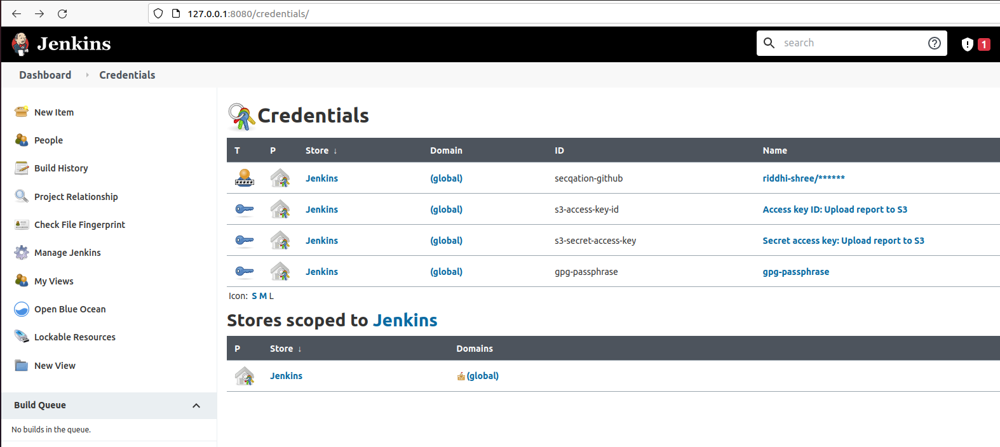
8. In the **Global credentials** page, click on **Add Credentials** link
9. From **Kind** dropdown list, select `Secret text` option
10. In the **Secret** input field, enter your secret value
11. In the **ID** input field, enter an identifying name
12. Click on **OK** button

Repeat above steps for storing AWS access key ID, AWS secret access key, and any other secrets.

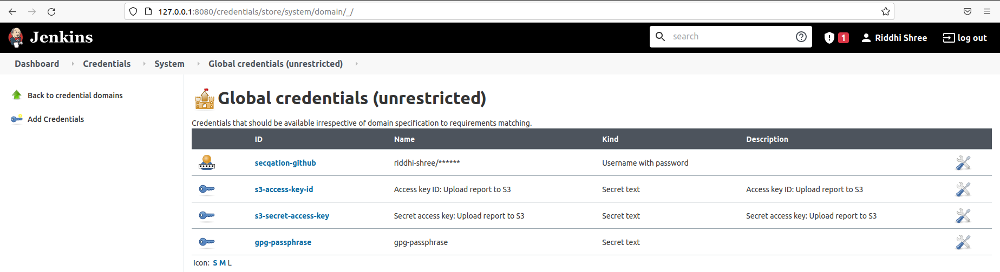

## Update Jenkinsfile

13. In the **Jenkinsfile**, add steps to upload the robot test execution results to S3 bucket.

    ```ruby
    pipeline{
        agent any
        stages{
            stage('Cleanup'){
                steps{
                    sh 'docker stop selenium-hub firefox_1 firefox_2 robotframework || true'
                    sh 'docker rm selenium-hub firefox_1 firefox_2 robotframework || true'
                    sh 'docker volume rm $(docker volume ls -qf dangling=true) || true'
                }
            }

            stage('Start Selenium Grid'){
                steps{
                    sh 'docker-compose build'
                    sh 'docker-compose up -d selenium-hub firefox_1 firefox_2'
                }
            }

            stage('Run Tests'){
                steps{
                    sh 'docker-compose up robotframework'
                }
            }
        }

        environment{ 
            AWS_ACCESS_KEY_ID = credentials('s3-access-key-id') 
            AWS_SECRET_ACCESS_KEY = credentials('s3-secret-access-key')
            // GPG_PASSPHRASE = credentials('gpg-passphrase')
            GPG_FINGERPRINT = 'riddhi@arogya.ai'
            PROFILE_NAME = 'secqation'
            S3_BUCKET_NAME = 'secqation.xyz'  
        }

        post{
            success{
                script{
                    // Create GPG
                    sh 'rm -r ~/.gnupg/ || true'
                    sh 'rm -r ~/.password-store || true'
                    sh 'gpg2 --list-keys'
                    sh 'gpg2 --pinentry-mode=loopback --batch --yes --passphrase --full-generate-key /home/gpg.txt'

                    // PASS initialize
                    sh "echo ${GPG_FINGERPRINT}"
                    sh "pass init ${GPG_FINGERPRINT}"

                    // AWS-VAULT initialize
                    // sh "echo y | aws-vault remove ${PROFILE_NAME} || true"
                    sh "pass rm ${PROFILE_NAME} || true"
                    sh "aws-vault add ${PROFILE_NAME} --env --backend=pass"
                    // sh "aws-vault ls"
                    // sh "pass"
                    sh 'pass ${PROFILE_NAME}'

                    // Upload test execution report to S3
                    // sh 'aws-vault exec ${PROFILE_NAME} -- aws sts get-caller-identity'
                    sh 'aws-vault exec ${PROFILE_NAME} -- aws s3 ls'
                    sh 'aws-vault exec ${PROFILE_NAME} -- aws s3 ls s3://${S3_BUCKET_NAME}'
                    sh 'aws-vault exec ${PROFILE_NAME} -- aws s3 cp report/ s3://${S3_BUCKET_NAME} --recursive'
                }
                archiveArtifacts artifacts: 'report/'
            }
            always{
                sh 'docker-compose down'
            }
        }
    }
    ```

    Notice how the **secrets** are being fetched from the Jenkins' credentials store, and **environment variables** are being created at runtime:

    ```ruby
    ...
    environment{ 
            AWS_ACCESS_KEY_ID = credentials('s3-access-key-id') 
            AWS_SECRET_ACCESS_KEY = credentials('s3-secret-access-key')
            GPG_PASSPHRASE = credentials('gpg-passphrase')
            GPG_FINGERPRINT = 'riddhi@arogya.ai'
            PROFILE_NAME = 'secqation'        
        }
    ...
    ```

*Note:* Sample code is available in following path - `/home/secqation/Desktop/NullconTraining2021/7-static-website-hosting`

## Push Changes to GitHub Repository

14. Start **ngrok**

    ```bash
    ./ngrok http 8080
    ```
    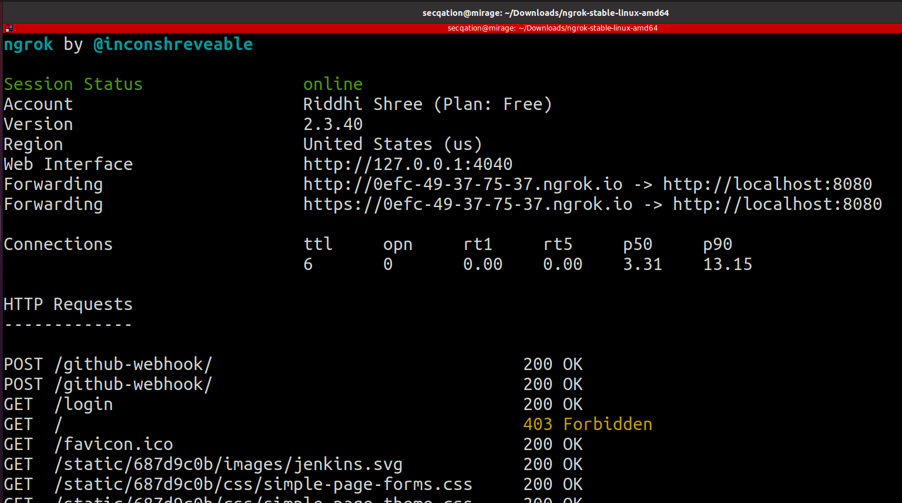

15. Update the **Payload URL** for webhook in GitHub

    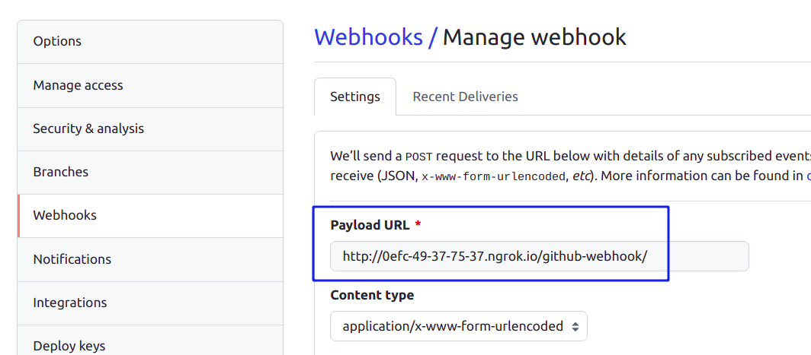

16. Push local changes to remote GitHub repository

    ```bash
    $ git add .
    $ git commit -m "Test S3 upload"
    $ git push
    ```

    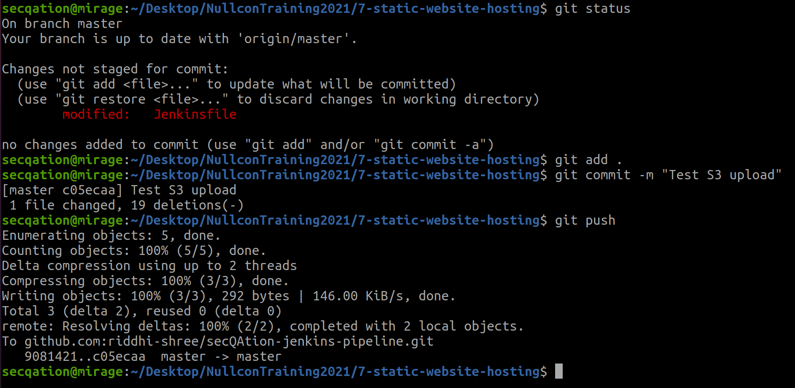

17. Wait for a while and visit your website at https://www.secqation.xyz to view the updated website contents.

## Is there a problem?

Unauthenticated users can access our sensitive security report...

## References
* https://github.com/aws-samples/amazon-cloudfront-secure-static-site#user-content-amazon-cloudfront-secure-static-website
* https://docs.aws.amazon.com/Route53/latest/DeveloperGuide/dns-configuring.html
* https://aws.amazon.com/premiumsupport/knowledge-center/prevent-cloudfront-from-caching-files/
* https://docs.aws.amazon.com/AmazonCloudFront/latest/DeveloperGuide/Invalidation.html#invalidation-specifying-objects-paths
* https://aws.amazon.com/blogs/networking-and-content-delivery/adding-http-security-headers-using-lambdaedge-and-amazon-cloudfront/
* https://infosec.mozilla.org/guidelines/web_security
* https://docs.aws.amazon.com/AmazonS3/latest/userguide/WebsiteAccessPermissionsReqd.html
* https://aws.amazon.com/premiumsupport/knowledge-center/cloudfront-serve-static-website/
* https://londonappdeveloper.com/2021/04/12/how-to-use-terraform-via-docker-compose-for-professional-developers/
* https://github.com/99designs/aws-vault
* https://docs.aws.amazon.com/cli/latest/userguide/install-cliv2-linux.html
* https://registry.terraform.io/providers/hashicorp/aws/latest/docs/resources/cloudfront_distribution
* https://www.jenkins.io/doc/book/pipeline/syntax/#declarative-sections
* https://medium.com/cuc4/aws-credential-hygiene-on-dev-machines-ed9e8793ea67
* https://blog.chapagain.com.np/gpg-remove-keys-from-your-public-keyring/
* https://www.passwordstore.org/
* https://access.redhat.com/documentation/en-us/red_hat_enterprise_linux/6/html/security_guide/sect-security_guide-encryption-gpg-creating_gpg_keys_using_the_command_line
* https://stackoverflow.com/questions/49072403/suppress-the-passphrase-prompt-in-gpg-command
* https://docs.github.com/en/github/authenticating-to-github/managing-commit-signature-verification/generating-a-new-gpg-key
* https://stackoverflow.com/questions/39596446/how-to-get-gpg-public-key-in-bash
* https://www.passwordstore.org/
