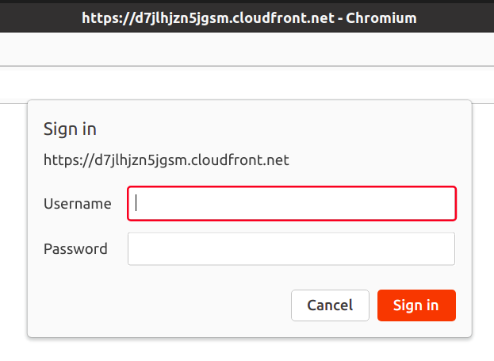

# Implementing authentication via Lamda Edge

## Private S3 Bucket

1. Login to AWS account
2. Go to https://s3.console.aws.amazon.com/
3. Click on "Create bucket" button
4. Enter a unique bucket name
5. Click on "Create bucket" button
6. A private S3 bucket should be created successfully.

## File Upload

1. Create "index.html" file
    ```html
    <html>My index file</html>
    ```
2. Go to https://s3.console.aws.amazon.com/
3. Select the newly created S3 bucket
4. Click on "Upload" button
5. Click on "Add files" button
6. Select your "index.html" file
7. Click on "Upload" >> "Close"

## CloudFront

1. Go to https://console.aws.amazon.com/cloudfront
2. Click on "Create distribution" button
3. Under "Origin domain", select your newly created private S3 bucket
4. Under "S3 bucket access", select `Yes use OAI (bucket can restrict access to only CloudFront)`
5. Click on "Create new OAI"
   1. Accept default entry, or, enter a new name
   2. Click on "Create" button
6. Under "Bucket policy", select `Yes, update the bucket policy`
7. Under "Viewer protocol policy", select 
`HTTPS only`
8. Under "Allowed HTTP methods", select `GET, HEAD`
9. Under "Settings" > "Price class", select a suitable option
10. Under "Settings" > "Default root object", enter `index.html`
11. Click on "Create distribution" button
12. Note down the CloudFront distribution ID

## Lambda@Edge

**Lambda@Edge** functions must be created in `us-east-1` region.

1. Go to https://console.aws.amazon.com/lambda/home?region=us-east-1
2. Click on "Create function" button
3. Select `Author from scratch` option
4. Enter a function name of your choice
5. Accept the default ruuntime, i.e. `Node.js 14.x`
6. Click on "Create function" button
7. Scroll down to "Code source" section
8. Replace the contents of "index.js" file with

    ```js
    exports.handler = (event, context, callback) => {

    // Get the request and its headers
    const request = event.Records[0].cf.request;
    const headers = request.headers;

    // Specify the username and password to be used
    const user = 'mirage';
    const pw = 'secqation';

    // Build a Basic Authentication string
    const authString = 'Basic ' + new Buffer(user + ':' + pw).toString('base64');

    // Challenge for auth if auth credentials are absent or incorrect
    if (typeof headers.authorization == 'undefined' || headers.authorization[0].value != authString) {
        const response = {
        status: '401',
        statusDescription: 'Unauthorized',
        body: 'Unauthorized',
        headers: {
            'www-authenticate': [{key: 'WWW-Authenticate', value:'Basic'}]
        },
        };
        callback(null, response);
    }

    // User has authenticated
    callback(null, request);
    };
    ```
9. Click on "Deploy" button
10. Click on "Configuration" tab >> "Permissions"
11. Under "Execution role", click on the role name
12. On the IAM role page, click on "Trust relationships" >> "Edit trust relationship"
13. Replace the line `"Service": "lambda.amazonaws.com"` with 

    ```
    "Service": ["lambda.amazonaws.com","edgelambda.amazonaws.com"]
    ```

14. Click on "Update Trust Policy" button
15. Return to the Lambda@Edge function page 
16. Click on "Actions" button
17. Click on `Publish new version` >> "Publish"
18. Click on "Add trigger"
19. Under "Trigger configuration", select `CloudFront`
20. Under "Configure CloudFront trigger" >> "Distribution", select the correct CloudFront distribution ID
21. Under "CloudFront event", select `Viewer request`
22. Select the `Confirm deploy to Lambda@Edge` checkbox
23. Click on "Add" button
24. Navigate to https://console.aws.amazon.com/cloudfront
25. Wait until the CloudFront distribution status changes from `Deploying...` to `Enabled`
26. This process might take a few minutes to complete
27. Once enabled, copy the **distribution domain name** and paste it in a browser window, e.g. https://d7jlhjzn5jgsm.cloudfront.net
28. You woud be prompted to enter a valid username and password

    

29. Only after correct credentials are provided, user would be allowed to access the `index.html` page

## Cleanup

When not needed anymore, make sure the S3, CloudFront and Lambda@Edge AWS resources are deleted. This will prvent incurring unnecessary costs.

**CloudFront**
1. Select your CloudFront distribution
2. Click on "Disable" button
3. Once disabled completely, click on "Delete" button
4. Click "Delete" in the confirmation box

**S3 Bucket**
1. Select your S3 bucket
2. Click on "Empty" button
3. Enter `permanently delete`
4. Click on "Empty" >> "Exit"
5. Select your emptied S3 bucket
6.  Click on "Delete" button
7.  Enter name of your S3 bucket in the confirmation box
8.  Click on "Delete bucket" button 

**Lambda@Edge**
1. Wait for a few hours
2. Select your lambda@edge function
3. Click on "Actions" >> "Delete"
4. [Refer this link](https://docs.aws.amazon.com/AmazonCloudFront/latest/DeveloperGuide/lambda-edge-delete-replicas.html)

Note: Replicated functions cannot be deleted instantly