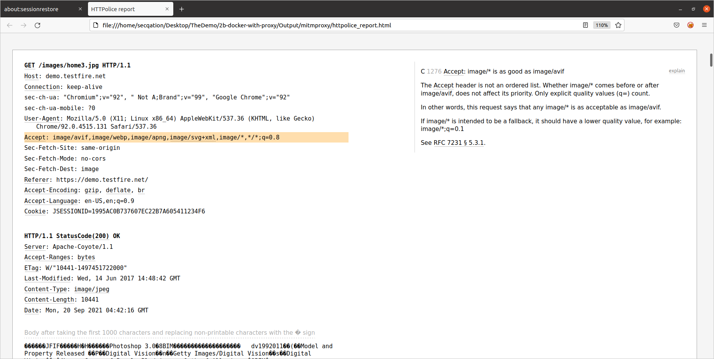
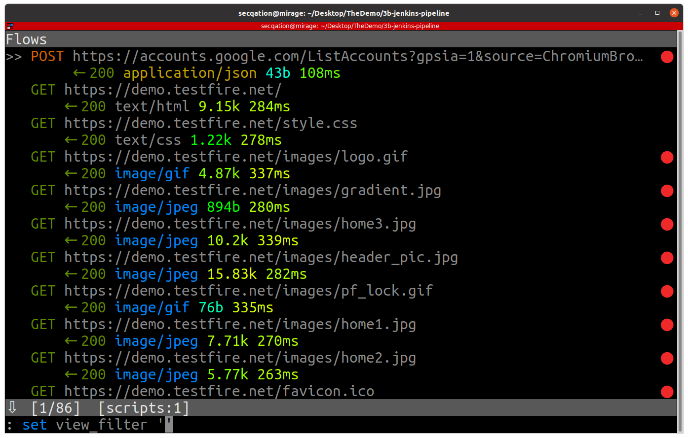
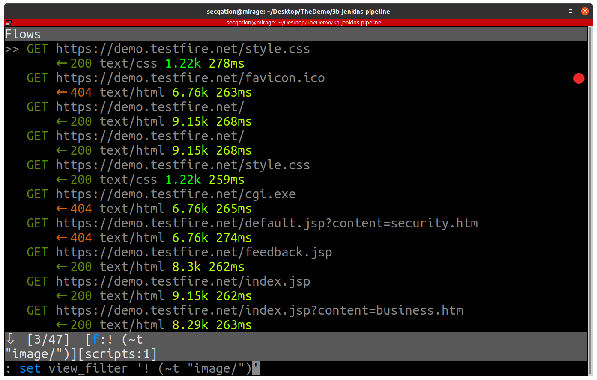
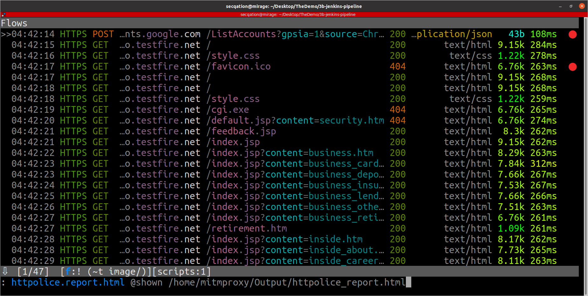
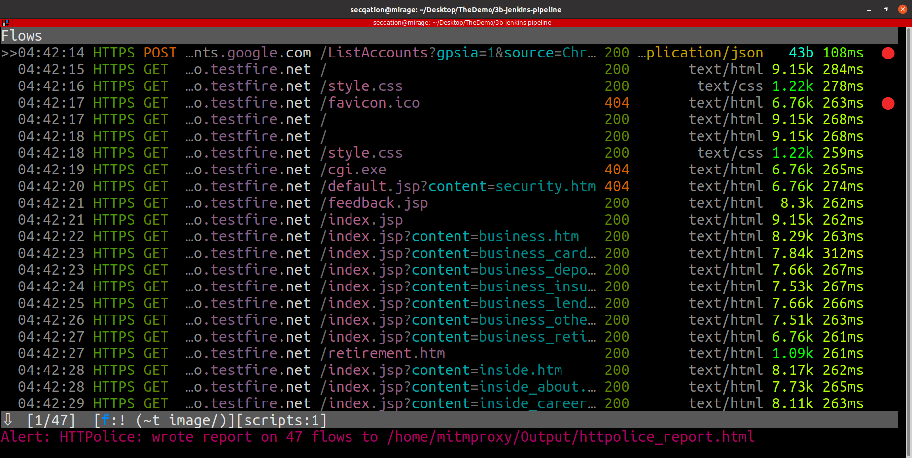
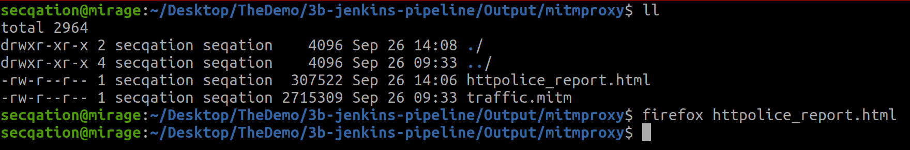
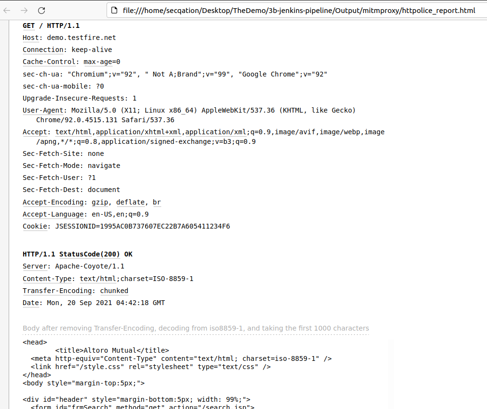
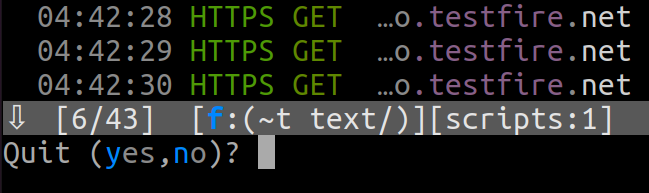

# Leveraging HTTPolice

[HTTPolice](https://httpolice.readthedocs.io/en/latest/index.html) is a validator or “linter” for **HTTP requests and responses**. It can spot bad header syntax, inappropriate status codes, and other potential problems in your HTTP server or client.


## Sample Report

The final report generated by HTTPolice looks like this:


## Installation

```python
pip3 install mitmproxy-HTTPolice
```

## Integrating HTTPolice with mitmproxy

The network traffic sniffed by mitmproxy tool can be filtered and passed as an input to HTTPolice, which in turn can generate an HTML report containing full requests and responses. Analysing, storing and sharing of a well structured auto-generated HTML report is a lot easier than trying to organize the data manually.

1. Run following commands:

    ```bash
    $ cd /home/secqation/Desktop/TheDemo/3b-jenkins-pipeline/
    $ ./init.sh
    ```

2. Check the contents of **init.sh** file. What is it doing?

    ```init.sh
    rm Input/mitmproxy/.mitmproxy/*
    rm Output/mitmproxy/*
    rm Output/robotframework/*

    docker-compose down

    docker-compose up -d --build mitmproxy
    docker-compose up -d --build selenium-hub firefox chrome

    docker exec -it mitmproxy openssl x509 -in /home/mitmproxy/.mitmproxy/mitmproxy-ca-cert.pem -inform PEM -out /tmp/mitmproxy-ca-cert.crt
    docker exec -it mitmproxy mkdir -p /usr/local/share/ca-certificates/
    docker exec -it mitmproxy cp /tmp/mitmproxy-ca-cert.crt /usr/local/share/ca-certificates/mitmproxy.crt
    docker exec -it mitmproxy update-ca-certificates

    docker-compose up --build robotframework

    docker-compose logs mitmproxy
    docker-compose ps
    docker-compose logs robotframework

    tree Output
    ls -la Output/mitmproxy
    ```

3. Check the contents of **docker-compose.yml** file. How did we configure proxy? Notice the use of environment variables **HTTP_PROXY** and **HTTPS_PROXY**

    ```yml
    version: "3.9"
    services:
    firefox:
        image: selenium/node-firefox:4.0.0-rc-1-prerelease-20210804
        shm_size: 2gb
        container_name: firefox
        depends_on:
        - selenium-hub
        environment:
        - SE_EVENT_BUS_HOST=selenium-hub
        - SE_EVENT_BUS_PUBLISH_PORT=4442
        - SE_EVENT_BUS_SUBSCRIBE_PORT=4443
        - HTTP_PROXY=http://mitmproxy:8080
        - HTTPS_PROXY=https://mitmproxy:8080
        volumes:
        - "robo-downloads:/home/seluser/Downloads"
        - "./Input/mitmproxy/.mitmproxy/:/tmp/.mitmproxy/"
        - "./Input/scripts:/scripts"
        command: sh -c "/scripts/install_ca_certficate.sh && exec /opt/bin/entry_point.sh"
        depends_on:
        - mitmproxy

    chrome:
        image: selenium/node-chrome:4.0.0-rc-1-prerelease-20210804
        shm_size: 2gb
        container_name: chrome
        depends_on:
        - selenium-hub
        environment:
        - SE_EVENT_BUS_HOST=selenium-hub
        - SE_EVENT_BUS_PUBLISH_PORT=4442
        - SE_EVENT_BUS_SUBSCRIBE_PORT=4443
        - HTTP_PROXY=http://mitmproxy:8080
        - HTTPS_PROXY=https://mitmproxy:8080
        volumes:
        - "robo-downloads:/home/seluser/Downloads"
        - "./Input/mitmproxy/.mitmproxy/:/tmp/.mitmproxy/"
        - "./Input/scripts:/scripts"
        command: sh -c "/scripts/install_ca_certficate.sh && /opt/bin/entry_point.sh"
        depends_on:
        - mitmproxy

    selenium-hub:
        image: selenium/hub:4.0.0-rc-1-prerelease-20210804
        container_name: selenium-hub
        ports:
        - "4442:4442"
        - "4443:4443"
        - "4444:4444"
        environment:
        - HTTP_PROXY=http://mitmproxy:8080
        - HTTPS_PROXY=https://mitmproxy:8080
        volumes:
        - "robo-downloads:/home/seluser/Downloads"
        - "./Input/mitmproxy/.mitmproxy/:/tmp/.mitmproxy/"
        - "./Input/scripts:/scripts"
        command: sh -c "/scripts/install_ca_certficate.sh && exec /opt/bin/entry_point.sh"
        depends_on:
        - mitmproxy

    robotframework:
        build:
        context: ./Input/robotframework/
        dockerfile: Dockerfile
        image: robotframework:latest
        container_name: robotframework
        environment:
        - HTTP_PROXY=http://mitmproxy:8080
        - HTTPS_PROXY=https://mitmproxy:8080
        - HUB_HOSTNAME=selenium-hub
        volumes:
        - "./Input/robotframework/demo-test-suite:/robo-vault/robo-tests"
        - "./Output/robotframework:/robo-vault/test_results"
        - "./Input/mitmproxy/.mitmproxy/:/tmp/.mitmproxy/"
        - "./Input/scripts:/scripts"
        command: sh -c "/scripts/install_ca_certficate.sh && exec ./healthcheck.sh"
        depends_on:
        - mitmproxy
        - firefox
        - chrome

    mitmproxy:
        build:
        context: ./Input/mitmproxy
        dockerfile: Dockerfile
        image: mitmproxy:latest
        container_name: mitmproxy
        volumes:
        - "./Input/mitmproxy/.mitmproxy/:/home/mitmproxy/.mitmproxy/"
        - "./Output/mitmproxy/:/home/mitmproxy/Output/"

    volumes:
    robo-downloads:
        name: robo-downloads
    ```

4. Also take a note of the volume mappings (especially for "mitmproxy" service)
5. Check the contents of **Dockerfile** for **mitmproxy** service.

    ```Dockerfile
    FROM mitmproxy/mitmproxy
    RUN apt-get update
    RUN apt-get install procps curl -y

    ENV LANG=en_US.UTF-8
    VOLUME /home/mitmproxy/.mitmproxy

    CMD ["mitmdump","-w","+/home/mitmproxy/Output/traffic.mitm","--set","ssl_insecure=true"]
    ```

    Notice that the intercepted traffic is being saved into a file called **traffic.mitm**. This file is saved in an **Output** folder that has a corresponding volume mapping in our host machine.

6. Once the **init.sh** script execution completes successfully, locate the **traffic.mitm** output file in path `/home/secqation/Desktop/TheDemo/3b-jenkins-pipeline/Output/mitmproxy`
7. Check the contents of **docker-compose-httpolice.yml** file

    ```yml
    version: "3.9"
    services:
    HTTPolice:
        build:
        context: .
        dockerfile: ./Input/HTTPolice/Dockerfile
        image: httpolice:latest
        container_name: httpolice
        volumes:
        - "./Output/mitmproxy/:/home/mitmproxy/Output/"
        command: mitmproxy -s "/usr/local/lib/python3.9/site-packages/mitmproxy_httpolice.py" -r /home/mitmproxy/Output/traffic.mitm --set httpolice_mark=comment --no-server 
        # command: mitmdump -r /home/mitmproxy/Output/traffic.mitm -s "/usr/local/lib/python3.9/site-packages/mitmproxy_httpolice.py -o html /home/mitmproxy/Output/http_report.html"
        # command: mitmdump --no-server -r /home/mitmproxy/Output/traffic.mitm --anticache --showhost --flow-detail 4 --ssl-insecure -s "/usr/local/lib/python3.9/site-packages/mitmproxy_httpolice.py"
        # command: mitmproxy --no-server -r /home/mitmproxy/Output/traffic.mitm --anticache --showhost --ssl-insecure -s "/usr/local/lib/python3.9/site-packages/mitmproxy_httpolice.py"
    ```

8. Run HTTPolice in **interactive mode** using Docker Compose **run** command

    ```bash
    docker-compose -f docker-compose-httpolice.yml run HTTPolice
    ```
    

9. Filter out unwanted traffic. Press **[F]** key on keyboard and enter a [filter expression](https://docs.mitmproxy.org/stable/concepts-filters/)

    ```
    : set view_filter '! ~u firefox|mozilla'
    : set view_filter '! (~t "image/")'
    : set view_filter '(~t text/)'
    ```

        

10. Export the filtered HTTP requests and responses using HTTPolice commad

    ```
    : httpolice.report.html @shown /home/mitmproxy/Output/httpolice_report.html
    ```

    

11. Once the **HTML report** is exported, open it in a bowser (and analyze)

    

    ```
    $ firefox httpolice_report.html
    ```

    
    

12. Press **[Q]** key on keyboard. When promptetd, press **[Y]** key to exit the interactive mitmproxy shell

    

## Reference

* https://httpolice.readthedocs.io/en/latest/index.html
* https://httpolice.readthedocs.io/en/latest/concepts.html
* https://httpolice.readthedocs.io/en/latest/quickstart.html#using-mitmproxy
* https://docs.mitmproxy.org/stable/concepts-filters/