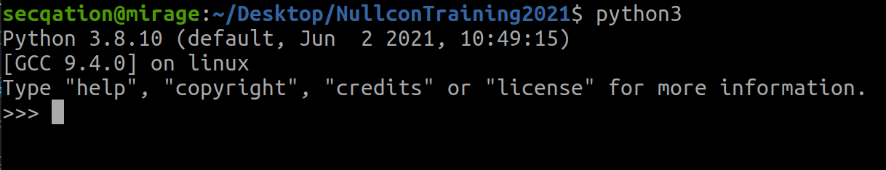
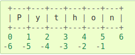

# Basics of Python programming

## Interpreter

1. Open a terminal by pressing **[CTRL]+[ALT]+[T]** keys
2. Type `python3` and press **[ENTER]**

    

3. Try out below mentioned examples, and understand what's happening.
4. To exit the interpreter, type `quit()` and press **[ENTER]** 

## Numerical Operators

* `+`, `-`, `*`, `/`, `//` (floor division), `%` (remainder), `**` (power), `=`

## Strings

1. Run following two commands and explain the difference in output

    ```python
    >>> print('C:\some\name')
    >>> print(r'C:\some\name')
    ```

   Which of the above represents a **raw string**?
2. String literals can span **multiple lines** by using triple-quotes: `"""..."""` or `'''...'''`.
3. Strings can be **concatenated** with the `+` operator, and **repeated** with `*`

    ```python
    >>> 3 * 'un' + 'ium'
    ```

4. **Slicing**

    ```python
    >>> word = 'Python'
    >>> word[0:2]  # characters from position 0 (included) to 2 (excluded)
    >>> word[2:5]  # characters from position 2 (included) to 5 (excluded)
    >>> word[:2]   # character from the beginning to position 2 (excluded)
    >>> word[4:]   # characters from position 4 (included) to the end
    >>> word[-2:]  # characters from the second-last (included) to the end
    ```

    Note how the start is always included, and the end always excluded. This makes sure that `s[:i]` + `s[i:]` is always equal to `s`:

    

## Lists

```python
>>> cubes = [1, 8, 27, 65, 125]
>>> cubes.append(216)  # add the cube of 6
```
```python
>>> letters = ['a', 'b', 'c', 'd', 'e', 'f', 'g']
>>> letters[2:5] = ['C', 'D', 'E']
>>> letters[2:5] = []
>>> letters[:] = []
>>> len(letters)
```

## Control Flow Tools

### if

```python
>>> x = int(input("Please enter an integer: "))
Please enter an integer: 42
>>> if x < 0:
...     x = 0
...     print('Negative changed to zero')
... elif x == 0:
...     print('Zero')
... elif x == 1:
...     print('Single')
... else:
...     print('More')
...
```

### for

```python
>>> # Measure some strings:
... words = ['cat', 'window', 'defenestrate']
>>> for w in words:
...     print(w, len(w))
...
```

### while

```python
>>> # Fibonacci series:
... a, b = 0, 1
>>> while a < 1000:
...     print(a, end=',')
...     a, b = b, a+b
...
0,1,1,2,3,5,8,13,21,34,55,89,144,233,377,610,987,
```

### range()

```python
>>> for i in range(5):
...     print(i)
...
```

```python
>>> list(range(0, 10, 3))
[0, 3, 6, 9]
```

```python
>>> a = ['Mary', 'had', 'a', 'little', 'lamb']
>>> for i in range(len(a)):
...     print(i, a[i])
...
```

### break

```python
>>> for n in range(2, 10):
...     for x in range(2, n):
...         if n % x == 0:
...             print(n, 'equals', x, '*', n//x)
...             break
...     else:
...         # loop fell through without finding a factor
...         print(n, 'is a prime number')
...
```

### continue

```python
>>> for num in range(2, 10):
...     if num % 2 == 0:
...         print("Found an even number", num)
...         continue
...     print("Found an odd number", num)
...
```

## Functions

```python
>>> def fib(n):    # write Fibonacci series up to n
...     """Print a Fibonacci series up to n."""
...     a, b = 0, 1
...     while a < n:
...         print(a, end=' ')
...         a, b = b, a+b
...     print()
...
>>> fib(2000)
```

## Default Argument Values

```python
def ask_ok(prompt, retries=4, reminder='Please try again!'):
    while True:
        ok = input(prompt)
        if ok in ('y', 'ye', 'yes'):
            return True
        if ok in ('n', 'no', 'nop', 'nope'):
            return False
        retries = retries - 1
        if retries < 0:
            raise ValueError('invalid user response')
        print(reminder)
```

This function can be called in several ways:

1. By giving only the **mandatory** argument:
  
    ```python
    ask_ok('Do you really want to quit?')
    ```

2. By giving one of the **optional** arguments:
  
    ```python
    ask_ok('OK to overwrite the file?', 2)
    ```

3. By giving **all** arguments:
    
    ```python
    ask_ok('OK to overwrite the file?', 2, 'Come on, only yes or no!')
    ```

## Further Reading

* https://docs.python.org/3/tutorial/introduction.html
