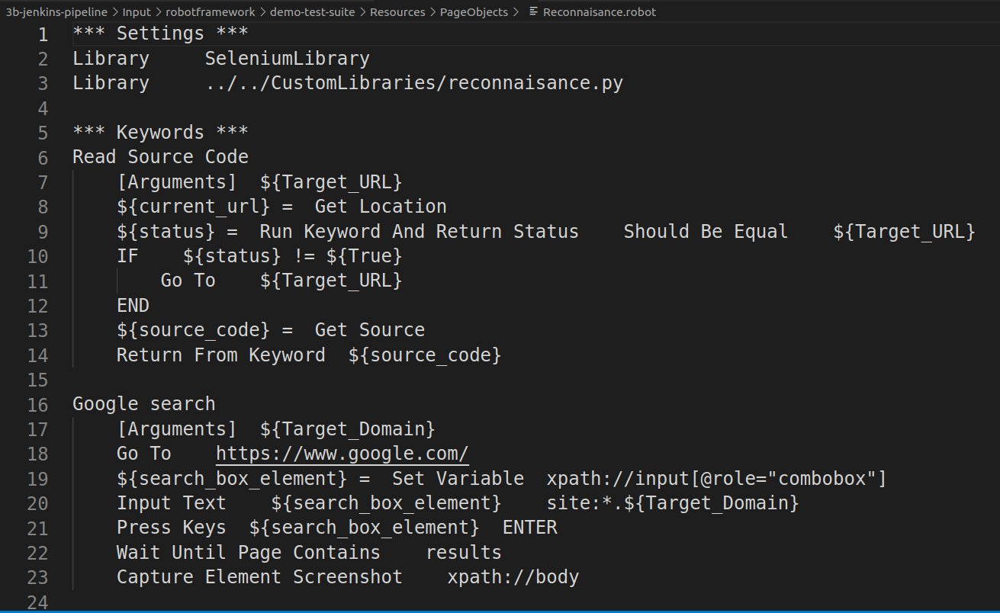
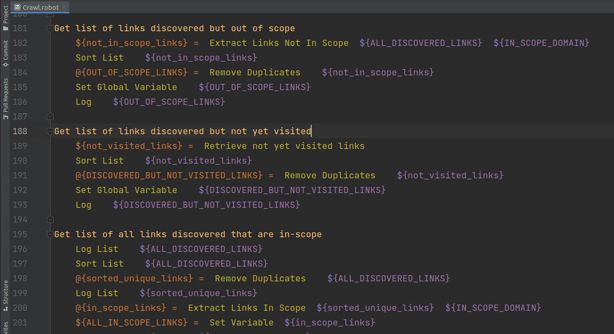
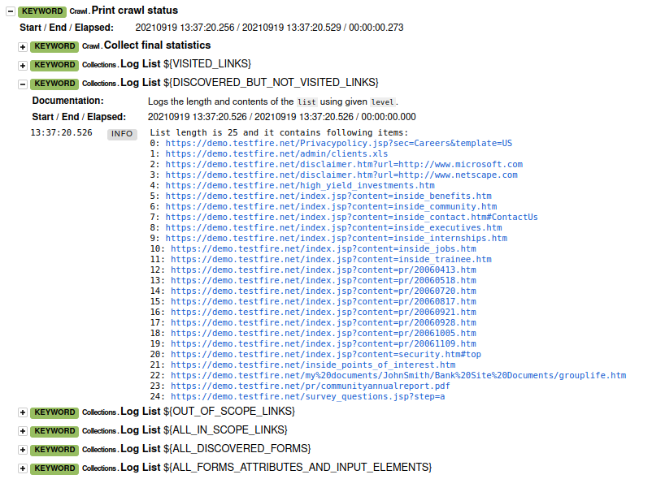

# Example: Custom Keywords Library

1. Create a python file, e.g., `reconnaisance.py`
2. Add python functions

    ```python
    import requests
    from bs4 import BeautifulSoup
    from tldextract import extract
    import re

    try:
        from urlparse import urljoin, urlparse  # Python2
    except ImportError:
        from urllib.parse import urljoin, urlparse  # Python3


    def grab_hyperlinks(source_code):
        soup = BeautifulSoup(source_code, 'html.parser')
        set_of_links = set()
        print(soup.find_all('a'))
        for link in soup.find_all('a'):
            print(link)
            href = link.get('href')
            set_of_links.add(href)
        unique_links = (list(set_of_links))
        return unique_links


    def build_url_from_url_path(base_url, url_paths):
        set_of_urls = set()
        for url_path in url_paths:
            url = urljoin(base_url, url_path)
            set_of_urls.add(url)
        print(set_of_urls)
        return set_of_urls


    def grab_forms(source_code):
        soup = BeautifulSoup(source_code, 'html.parser')
        set_of_forms = set()
        for form in soup.find_all('form'):
            set_of_forms.add(form)
        unique_forms = (list(set_of_forms))
        print(unique_forms)
        return unique_forms


    def find_javascript_usage(url):
        reqs = requests.get(url)
        soup = BeautifulSoup(reqs.text, 'html.parser')
        set_of_scripts = set()
        for element in soup.find_all('script'):
            set_of_scripts.add(element)
        unique_scripts = (list(set_of_scripts))
        print(unique_scripts)
        return unique_scripts


    def search_for_sensitive_keywords(source_code, search_keywords):
        search_results = {}
        for keyword in search_keywords:
            print(keyword)
            items = re.findall(r"^.*"+keyword+".*$", source_code, re.IGNORECASE)
            for x in items:
                print(x)
            search_results[keyword] = items
        print(search_results)
        return search_results


    def search_by_regular_expression(source_code, search_pattern):
        results = re.findall(search_pattern, source_code, re.MULTILINE)
        for x in results:
            print(x)
        return results


    def extract_domain(url):
        tsd, td, tsu = extract(url)
        print(url, tsd, td, tsu)
        domain = td + '.' + tsu  # will print as hostname.com
        if not tsu:
            domain = tsd + '.' + td
        print(domain)
        return domain


    def remove_already_visited_links(target_urls,  visited_links):
        not_visited_links = [x for x in target_urls if x not in visited_links]
        print(not_visited_links)
        return not_visited_links


    def extract_links_in_scope(target_urls, target_domain):
        in_scope_links = [x for x in target_urls if extract_domain(x) == target_domain]
        print(in_scope_links)
        return in_scope_links


    def extract_links_not_in_scope(target_urls, target_domain):
        not_in_scope_links = [x for x in target_urls if not re.match(r'.*'+target_domain+'.*', x)]
        print(not_in_scope_links)
        return not_in_scope_links


    def check_if_url_has_been_visited_already(url, visited_links):
        if url in visited_links:
            return True
        else:
            return False


    def export_data_to_file(data, absolute_filename):
        print(absolute_filename)
        print(data)
        with open(absolute_filename, 'w') as f:
            f.write('\n'.join(data))
        f.close()
        with open(absolute_filename+".BACKUP", 'w') as dup:
            dup.write('\n'.join(data))
        dup.close()
        return absolute_filename


    def fetch_first_unread_value(absolute_filename):
        with open(absolute_filename, 'r+') as f1:
            first_value = f1.readline()
            print(first_value)
            rows = f1.readlines()
            print(rows)
            f1.seek(0)
            f1.writelines(rows)
        f1.close()

        with open(absolute_filename + "_ReadAlready", 'a') as f2:
            f2.write(first_value)
        f2.close()

        return first_value
    ```

3. Import the library in your `.robot` file

    

4. Call custom keywords

    

5. Keyword output will be part of the finall report

    
