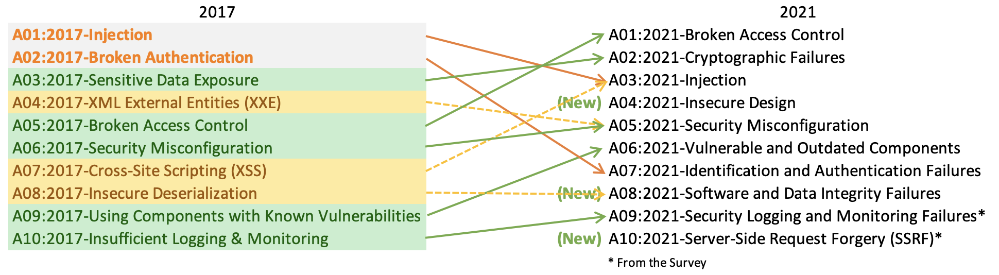

# OWASP Top 10 2021

1. A01:2021-Broken Access Control
2. A02:2021-Cryptographic Failures
3. A03:2021-Injection
4. A04:2021-Insecure Design
5. A05:2021-Security Misconfiguration
6. A06:2021-Vulnerable and Outdated Components
7. A07:2021-Identification and Authentication Failures
8. A08:2021-Software and Data Integrity Failures
9. A09:2021-Security Logging and Monitoring Failures
10. A10:2021-Server-Side Request Forgery

## Let Me Explain

1. **A01:2021-Broken Access Control**: Parameter tampering, URL tampering, CORS misconfiguration
   * [Broken Authentication and Authorization Scenarios](https://slides.com/riddhishreechaurasia/build-break-learn#/5)
   * [Example: Generate valid JWT token by modifying the vulnerable "email" input parameter](https://slides.com/riddhishreechaurasia/things-dev-do#/3/1)
   * [JWT Toolkit: Attacking JWT Tokens](https://github.com/riddhi-shree/knowledge-sharing/blob/master/Web/web_attacks/jwt_toolkit/README.md)
2. **A02:2021-Cryptographic Failures**: This includes security failures when data is in transit or at rest, such as the implementation of weak cryptographic algorithms, poor or lax key generation, a failure to implement encryption or to verify certificates, and the transmission of data in cleartext.
   * [Example: Decrypting RSA](https://www.riddhishree.com/posts/decrypting_rsa/)
   * [Example: Hashes do NOT ensure safety on their own!](https://www.riddhishree.com/posts/breaking_hashes/)
3. **A03:2021-Injection**:
   * [Various types of Injection attacks](https://slides.com/riddhishreechaurasia/build-break-learn#/2/2)
   * [Cross-Site Scripting](https://slides.com/riddhishreechaurasia/build-break-learn#/3)
4. **A04:2021-Insecure Design**: Not following secure design patterns and principles
   1. Follow best practices and secure design principles, wherever possible
   2. Build things with security-centric mindset
   3. Conduct code reviews to avoid any bad code going into the production
   4. Conduct regular code audits and pentests
5. **A05:2021-Security Misconfiguration**: The simplest example would be misconfigurations in the cloud service called IAM (Identity and Access Management). If the permissions assigned to an entity is more than it needs to do it’s job effectively, this could open room for exploitation, if the credentials for that entity got compromised or misused by trusted parties.
   1. [Security Misconfigurations](https://slides.com/riddhishreechaurasia/build-break-learn#/8/1)
   2. [Example: Amazon Cognito misconfiguration](https://slides.com/riddhishreechaurasia/things-dev-do#/4)
   3. [Example: Cognito misconfiguration detection and exploitation technique](https://github.com/riddhi-shree/knowledge-sharing/blob/master/Mobile/Android/amazon_cognito_authz_issue/README.md)
   4. [Exploiting XML External Entity](https://github.com/riddhi-shree/knowledge-sharing/blob/master/Web/web_attacks/exploiting_xxe/README.md)
6. **A06:2021-Vulnerable and Outdated Components**:
   [Example: Zero-day in Sign in with Apple](https://slides.com/riddhishreechaurasia/things-dev-do#/2)
   1. Maintain an inventory of components you are using and ensure that they are kept up-to-date
   2. Remove unused dependencies and components
   3. Install the components via trusted channels and make sure to validate their integrity. Also, it’s better to use signed packages (if available)
   4. Be on the lookout for any security patches for the components you are relying on. If the packages you use are not maintained, then either make sure you apply patches yourself or use some alternate component that is well maintained. 
7. **A07:2021-Identification and Authentication Failures**: Password bruteforcing, credential stuffing, flawed password reset functionality, mishandled/weak session identifiers
   * [Example: Improper API rate limiting](https://slides.com/riddhishreechaurasia/things-dev-do#/5)
   * [Examplle: Security Shepherd — Broken Auth and Session Management Challenge 5](https://riddhi-shree.medium.com/security-shepherd-broken-auth-and-session-management-challenge-5-d3044e25a784)
8. **A08:2021-Software and Data Integrity Failures**: How sure are you about the integrity of the apps or data that you are consuming? Ensure that a software supply chain security tool, such as **OWASP Dependency Check** or **OWASP CycloneDX**, is used to verify that components do not contain known vulnerabilities.
   * [Example: Supply chain attack trojanized SolarWinds Orion business software updates in order to distribute malware](https://www.fireeye.com/blog/threat-research/2020/12/evasive-attacker-leverages-solarwinds-supply-chain-compromises-with-sunburst-backdoor.html)
9.  **A09:2021-Security Logging and Monitoring Failures**: When a security-critical event occurs, the software either does not record the event or omits important details about the event when logging it. When security-critical events are not logged properly, such as a failed login attempt, this can make malicious behavior more difficult to detect and may hinder forensic analysis after an attack succeeds. If security critical information is not recorded, there will be no trail for forensic analysis and discovering the cause of problems or the source of attacks may become more difficult or impossible.
10. **A10:2021-Server-Side Request Forgery**: 
    * https://blog.appsecco.com/server-side-request-forgery-via-html-injection-in-pdf-download-90ee4053e911
    * https://owasp.org/Top10/A10_2021-Server-Side_Request_Forgery_%28SSRF%29/

## Getting Serious?

**Pre-requisites:**
Create a free account on [portswigger.net](https://portswigger.net/users/register)

**Try out these labs:**
1. [SQL Injection](https://portswigger.net/web-security/sql-injection)
2. [XSS](https://portswigger.net/web-security/cross-site-scripting)
3. [CSRF](https://portswigger.net/web-security/csrf)
4. [Clickjacking](https://portswigger.net/web-security/clickjacking)
5. [XXE](https://portswigger.net/web-security/xxe)
6. [Many More](https://portswigger.net/web-security/all-labs)

## Further Reading

* https://owasp.org/Top10/
* https://owasp.org/Top10/A01_2021-Broken_Access_Control/
* https://portswigger.net/daily-swig/owasp-shakes-up-web-app-threat-categories-with-release-of-draft-top-10
* https://owasp.org/Top10/A02_2021-Cryptographic_Failures/
* https://medium.com/@shivam_bathla/a05-2021-security-misconfiguration-fe6d321d71d7
* https://medium.com/@shivam_bathla/a06-2021-vulnerable-and-outdated-components-a5d96017049c
* https://medium.com/@shivam_bathla/a07-2021-identification-and-authentication-failures-b585c856eb24
* https://www.sans.org/brochure/course/log-management-in-depth/6
* https://owasp-top-10-proactive-controls-2018.readthedocs.io/en/latest/c9-implement-security-logging-monitoring.html
* https://cwe.mitre.org/data/definitions/778.html
* https://docs.microsoft.com/en-us/azure/architecture/best-practices/monitoring