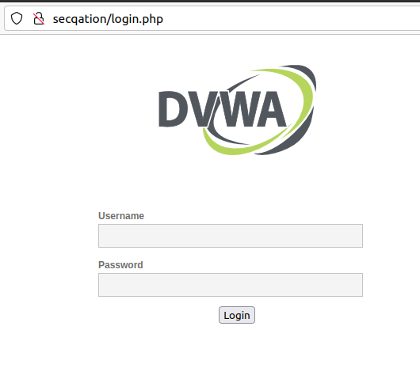
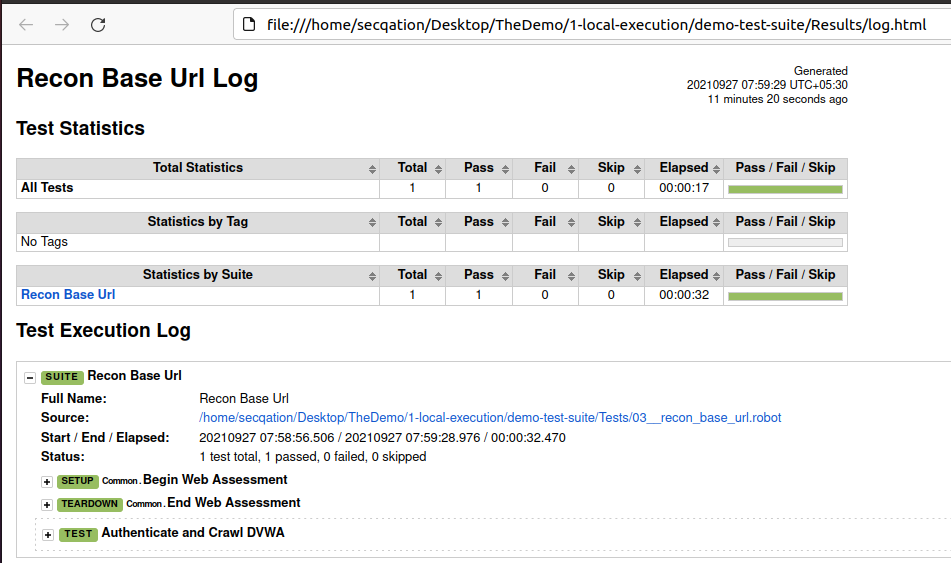
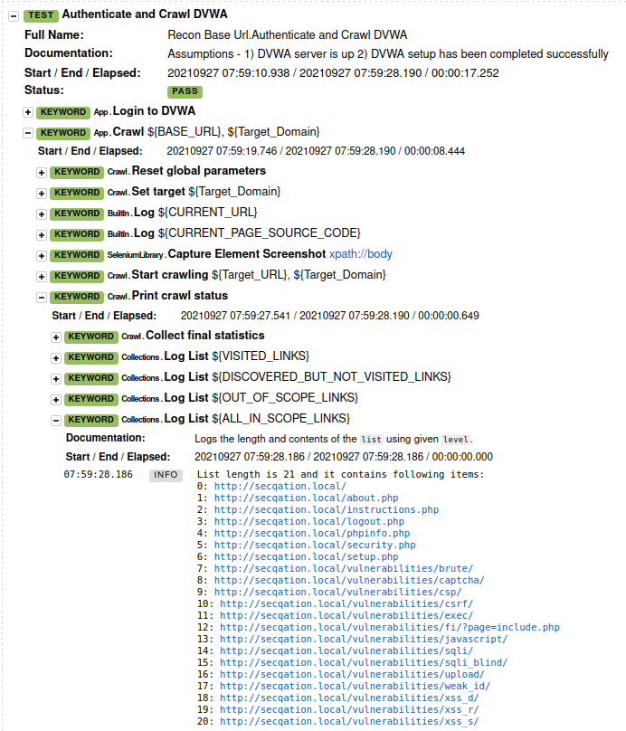
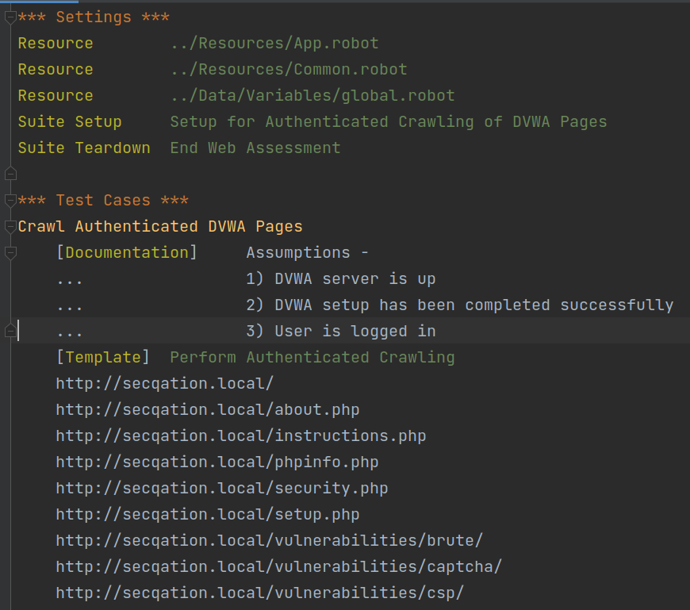
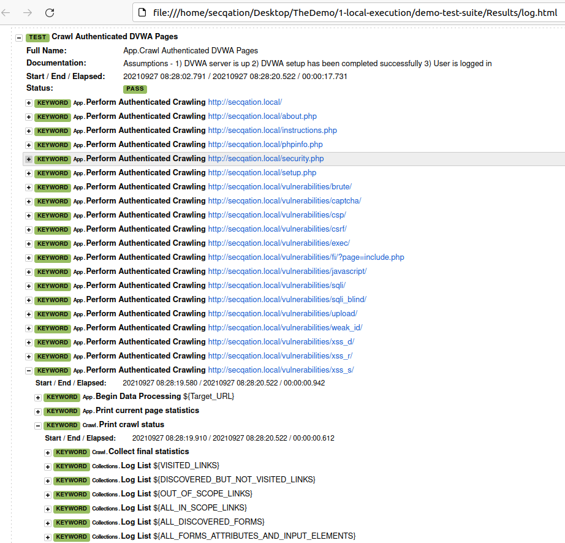
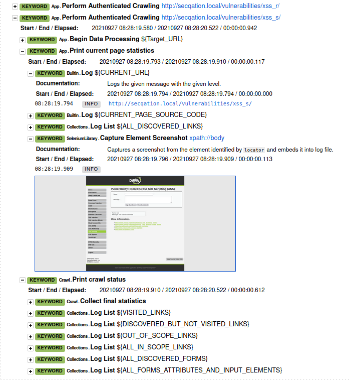
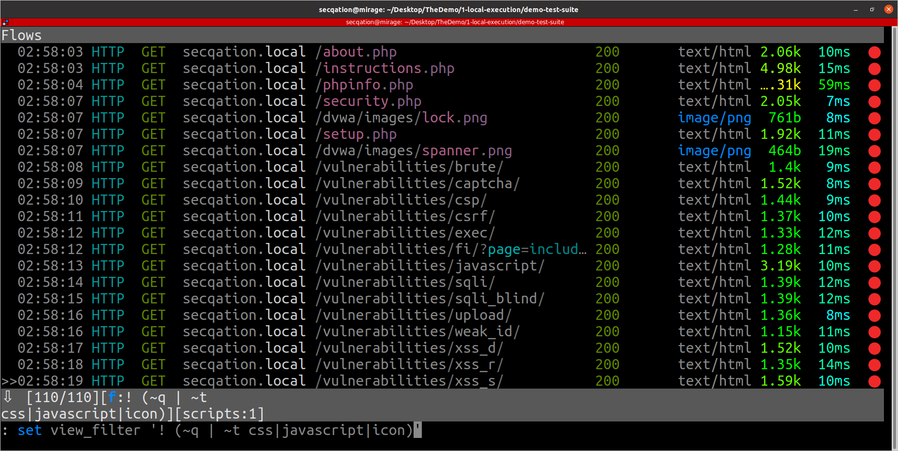
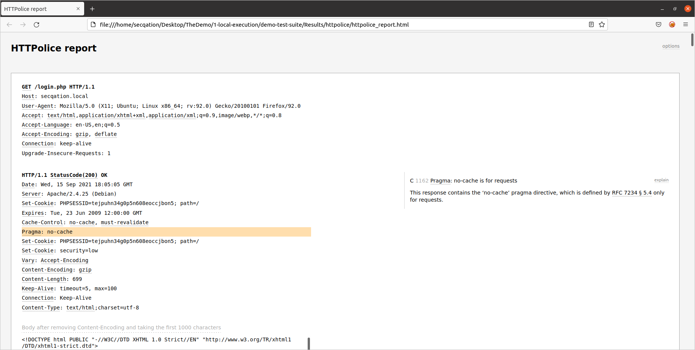

# DVWA: Get Your Hands Dirty

Damn Vulnerable Web App (DVWA) is a PHP/MySQL web application that is damn vulnerable. Let's solve [DVWA](https://dvwa.co.uk/).

## Pre-requisites

* Add following line to **/etc/hosts** file: `127.0.1.1	secqation.local`

## Purely Manual Approach

1. Start your own vulnerable instance of DVWA

    ```bash
    docker run --rm -it -p 80:80 vulnerables/web-dvwa
    ```

2. Go to http://secqation/login.php

    

3. Start hacking.

## SecQAtion Approach

Let's make hacking DVWA a bit more interesting...

1. Go to `/home/secqation/Desktop/TheDemo/1-local-execution/demo-test-suite` folder path
2. Check the contents of **init.sh** file in **BashScripts** folder

    ```bash
    mitmdump -p 8080 -w +traffic.mitm "! ~u firefox|ocsp|mozilla|googleapis" &
    robot -d ~/Desktop/TheDemo/1-local-execution/demo-test-suite/Results ~/Desktop/TheDemo/local-execution/demo-test-suite/Tests/${1:-App.robot}
    pkill mitmdump
    echo "Test Complete."
    ```

    Notice the use of `${1:-App.robot}`. It says that if no parameter value is passed when calling the bash script, then **App.robot** test case should be executed by default. In case a specific filename is passed, then that specific test suite should be executed.

3. Check the contents of **Tests** folder

    ```bash
    $ tree Tests/
    Tests/
    ├── 01__setup_dvwa.robot
    ├── 02__teardown_dvwa.robot
    ├── 03__recon_base_url.robot
    └── App.robot
    ```

4. Check the contents of `.robot` files
   1. **Tests/01__setup_dvwa.robot**

        ```robot
        *** Settings ***
        Resource        ../Resources/App.robot
        Resource        ../Resources/Common.robot
        Resource        ../Data/Variables/global.robot
        Suite Setup     Begin Web Assessment
        Suite Teardown  End Web Assessment

        *** Test Cases ***
        Setup DVWA
        #    [Teardown]  Stop DVWA
            Start a local instance of DVWA
            Login to DVWA
            Setup Database for DVWA
            Re-login to DVWA
        ```

   2. **Tests/02__teardown_dvwa.robot**

        ```robot
        *** Settings ***
        Resource        ../Resources/App.robot
        Resource        ../Resources/Common.robot

        *** Test Cases ***
        Destroy DVWA Running Docker Instance
            Stop DVWA
        ```

   3. **Tests/03__recon_base_url.robot**

        ```robot
        *** Settings ***
        Resource        ../Resources/App.robot
        Resource        ../Resources/Common.robot
        Resource        ../Data/Variables/global.robot
        Suite Setup     Begin Web Assessment
        Suite Teardown  End Web Assessment

        *** Test Cases ***
        Authenticate and Crawl DVWA
            [Documentation]     Assumptions -
            ...                 1) DVWA server is up
            ...                 2) DVWA setup has been completed successfully
            Login to DVWA
            Crawl    ${BASE_URL}    ${Target_Domain}
        ```

   4. **Tests/App.robot**

        ```robot
        *** Settings ***
        Resource        ../Resources/App.robot
        Resource        ../Resources/Common.robot
        Resource        ../Data/Variables/global.robot
        Suite Setup     Setup for Authenticated Crawling of DVWA Pages
        Suite Teardown  End Web Assessment

        *** Test Cases ***
        Crawl Authenticated DVWA Pages
            [Documentation]     Assumptions -
            ...                 1) DVWA server is up
            ...                 2) DVWA setup has been completed successfully
            ...                 3) User is logged in
            [Template]  Perform Authenticated Crawling
            http://secqation.local/
            http://secqation.local/about.php
            http://secqation.local/instructions.php
            http://secqation.local/phpinfo.php
            http://secqation.local/security.php
            http://secqation.local/setup.php
            http://secqation.local/vulnerabilities/brute/
            http://secqation.local/vulnerabilities/captcha/
            http://secqation.local/vulnerabilities/csp/
            http://secqation.local/vulnerabilities/csrf/
            http://secqation.local/vulnerabilities/exec/
            http://secqation.local/vulnerabilities/fi/?page=include.php
            http://secqation.local/vulnerabilities/javascript/
            http://secqation.local/vulnerabilities/sqli/
            http://secqation.local/vulnerabilities/sqli_blind/
            http://secqation.local/vulnerabilities/upload/
            http://secqation.local/vulnerabilities/weak_id/
            http://secqation.local/vulnerabilities/xss_d/
            http://secqation.local/vulnerabilities/xss_r/
            http://secqation.local/vulnerabilities/xss_s/
        ```

5. Run following commands to setup DVWA and do a quick scan of the base URL

    ```bash
    ./BashScripts/init.sh 01__setup_dvwa.robot
    ./BashScripts/init.sh 03__recon_base_url.robot
    ```

6. Open the **log.html** file (from Results folder) in a browser window

    

7. Click on **`Authenticate and Crawl DVWA`**
8. Click on **`App.Crawl ${Base_URL},${Target_Domain}`**
9. Click on **`Crawl.Print crawl status`**
10. Click on **`Collections.Log List ${ALL_IN_SCOPE_LINKS}`**

    

11. Copy the list of all in-scope URLs
12. Open **Tests/App.robot** test file, and pass this copied list of URLs as an argument to the **`Perform Authenticated Crawling`** test template

    

13. Switch to command line interface and run following command

    ```bash
    $ cd ~/Desktop/TheDemo/1-local-execution/demo-test-suite
    $ ./BashScripts/init.sh
    ```

14. Refresh **log.html** page in your browser to see updated results

    

15. Expand respective keywords to see detailed scan report of various URLs that were passed to the test template **Perform Authenticated Crawling**

    

15. Locate **mitmproxy_httpolice.py** file

    ```bash
    $ sudo apt install mlocate
    $ locate mitmproxy_httpolice.py
    ```

16. Check the contents of **`docker-compose-httpolice.yml`** file. Ensure that the **volume mappings** are correct.

    ```
    version: "3.9"
    services:
    HTTPolice:
        build:
        context: .
        dockerfile: ./Input/HTTPolice/Dockerfile
        image: httpolice:latest
        container_name: httpolice
        volumes:
        - "./traffic.mitm:/home/mitmproxy/Output/traffic.mitm"
        - - "./Results/httpolice:/home/mitmproxy/Output/httpolice"
        command: mitmproxy -s "/usr/local/lib/python3.9/site-packages/mitmproxy_httpolice.py" -r /home/mitmproxy/Output/traffic.mitm --set httpolice_mark=comment --no-server
    ```

17. Run following command

    ```bash
    docker-compose -f docker-compose-httpolice.yml run HTTPolice
    ```

18. Press **`[F]`** key to set a filter expression
19. Enter **`'! (~q | ~t css|javascript|icon)'`** as the filter expression. This will remove any request without a response or any request that has it's content type set as css, javascript or icon.

    

20. Run following command to export the HTML report for filtered traffic

    ```bash
    : httpolice.report.html @shown /home/mitmproxy/Output/httpolice/httpolice_report.html
    ```

21. Press **`[Q]`** key followed by **`[Y]`** key to exit mitmproxy
22. Access the exported HTML report from path **`./Results/httpolice/httpolice_report.html`**

    

23. If you find an interesting request, copy and paste it in Burp Suite's Repeater/Intruder tool
24. Ask doubts, if any.

>Hope you have learned something interesting.
>Happy Hacking... the SecQAtion way!!

## References:

* https://github.com/digininja/DVWA
