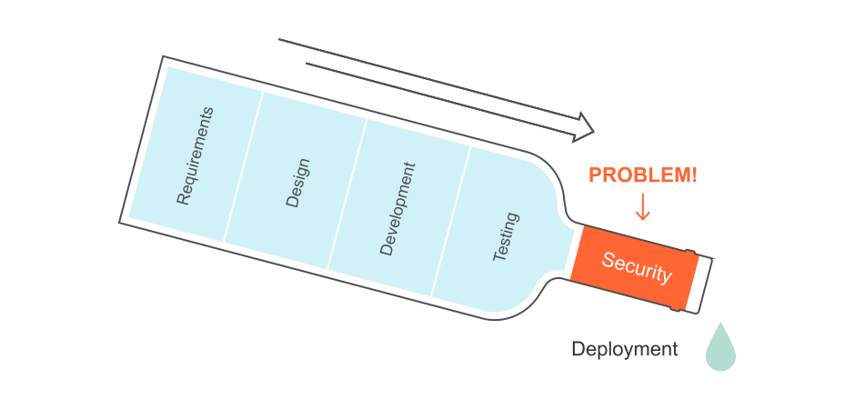
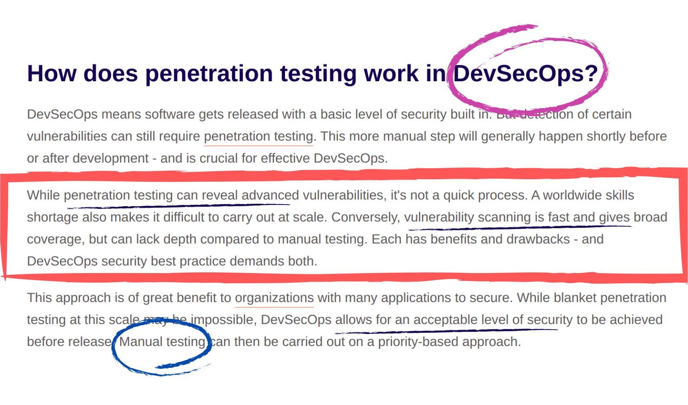

# Inconveniences/Gaps

## Developer's Perspective

In traditional software development, security is a bottleneck

## DevSecOps: Is there a scope for improvement?

* Do we really have to choose between manual testing and vulnerability scanning?
* Manual pentesting is slow and tedious, but highly effective
* Vulnerability scans are fast and effortless, but less reliable
* Is there a way to achive much more than a plain vulnerability scan? Is there a way to make manual testing less tedious? 

## Test Automation: Is it too tedious for pentesters? 
Not really.

## References:

* https://portswigger.net/solutions/devsecops/guide-to-devsecops
