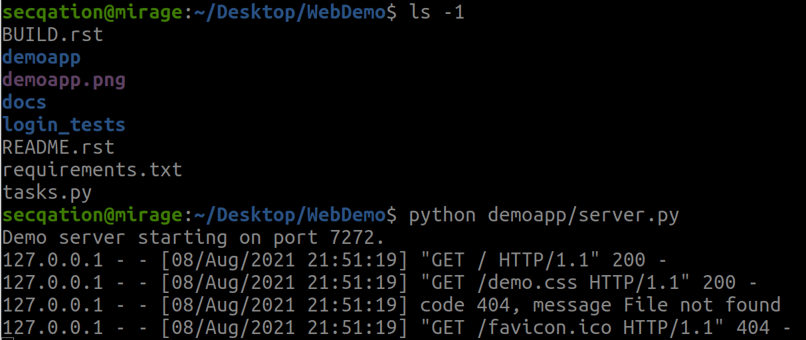
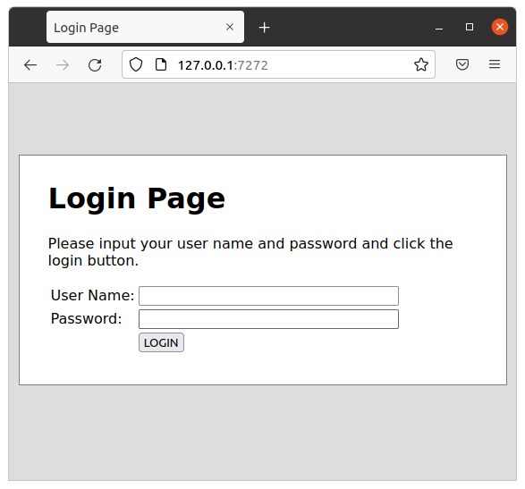
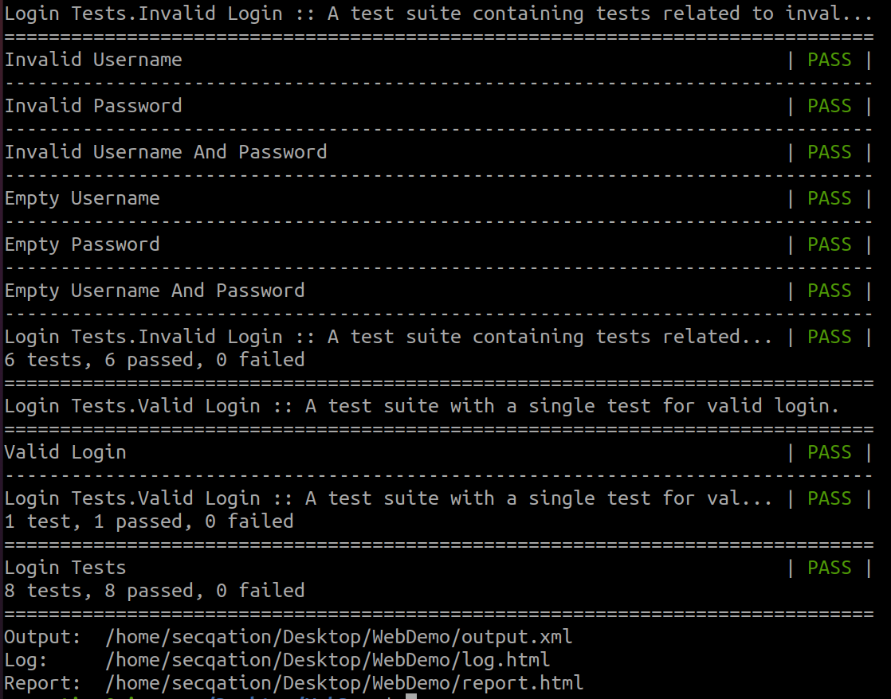
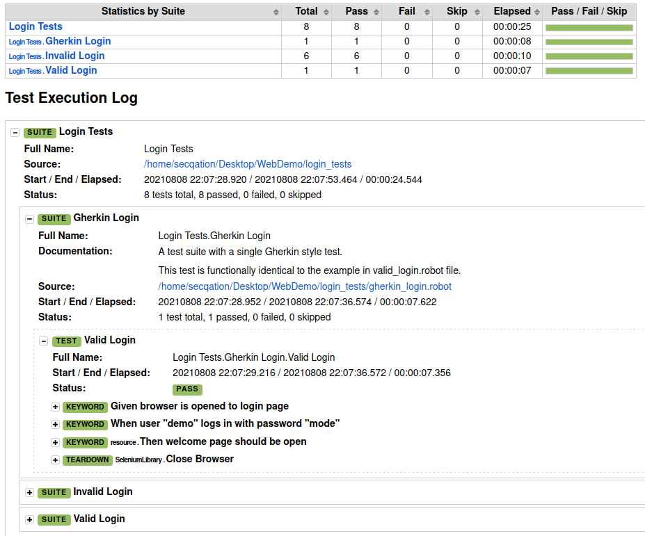

# Introduction to Robot Framework

## Overview

Robot Framework is a generic open source automation framework. It can be used for **test automation** and **robotic process automation** (RPA). **SeleniumLibrary** is one of the many test libraries that can be used with Robot Framework.

## Advantage

* Easy syntax
* Human-readable keywords
* Operating system and application independent
* Supports both Python 2.7 and Python 3.5+
* Has a rich ecosystem consisting of pre-existing libraries and tools
* Capabilities can be extended by libraries implemented with Python or Java

## Installation

```bash
pip install robotframework
pip install --upgrade robotframework-seleniumlibrary
sudo pip install webdrivermanager
sudo webdrivermanager firefox chrome --linkpath /usr/local/bin
```

More details [here](https://github.com/robotframework/robotframework/blob/master/INSTALL.rst) and [here](https://github.com/robotframework/SeleniumLibrary#installation).

## Demo: Standard Usage

1. Clone following GitHub repository
    ```
    git clone https://github.com/robotframework/WebDemo.git
    ```

2. Start the demo application
    ```
    cd WebDemo/
    python demoapp/server.py
    ```
    

3. Access the demo application by navigating to `127.0.0.1:7272`

    

4. Trigger automated test execution

    ```
    robot login_tests/
    ```
    

5. Access test execution report

    ```
    firefox log.html
    ```
    

## References

* [Installation instructions](https://github.com/robotframework/robotframework/blob/master/INSTALL.rst)
* [SeleniumLibrary](https://github.com/robotframework/SeleniumLibrary#installation)
* [Web testing with Robot Framework and SeleniumLibrary](https://github.com/robotframework/WebDemo)
* [Running Demo](https://github.com/robotframework/WebDemo#running-demo)
