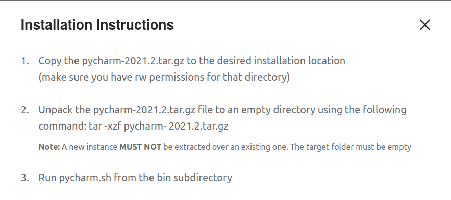
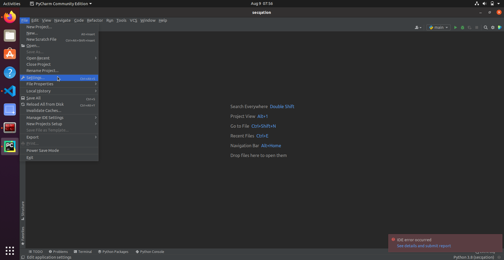
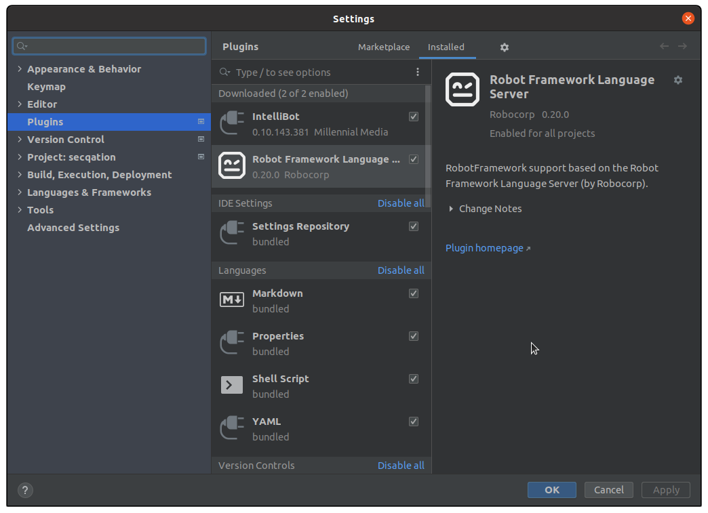
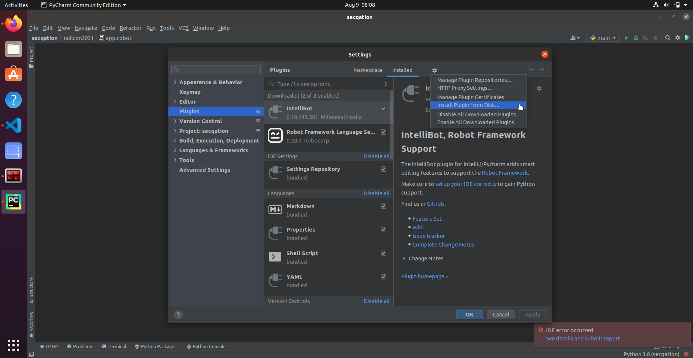

# Configuring PyCharm

1. Download [PyCharm](https://www.jetbrains.com/pycharm/download/#section=linux)
2. Install and run PyCharm
    
3. Go to "File" > "Settings"
    
4. Install the "Robot Framework Language Server" plugin
    
5. Download [intellibot.jar](https://github.com/millennialmedia/intellibot/raw/master/intellibot.jar)
6. Install `intellibot.jar` plugin to your IDE by using the 'Install plugin from disk...' option
    
7. Re-start PyCharm

## References

* [Download and install PyCharm](https://www.jetbrains.com/pycharm/download/#section=linux)
* [IntelliJ/PyCharm Plugin for Robot Automation Framework](https://github.com/mtrubs/intellibot)
* [intellibot.jar](https://github.com/millennialmedia/intellibot/raw/master/intellibot.jar)
