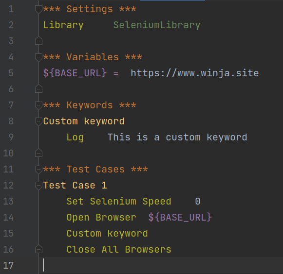
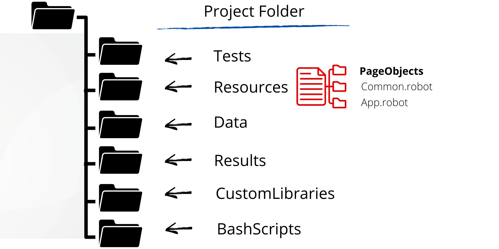

# Recommended Folder Structure

## Short on time? Create single robot file.

## For something more serious, get organized?

1. Be in control of your assets
2. Know where to find what
3. Avoid unmanageable pile of files, as your project grows bigger
4. Scale easily
5. Easy maintenance
6. etc.

In short, don't waste your time cleaning the garbage off your desk, when you could very well use that time for doing something more productive. Get organized now, to save time and effort later.

## What kind of structure are we talking about?

## Practice Exercise

1. Open PyCharm IDE
2. Create a new project
3. Create a folder structure as described below:
    * Create 6 folders: **Tests**, **Resources**, **Data**, **Results**, **CustomLibraries**, **BashScripts**
    * Create `App.robot` file inside **Tests** folder
    * Inside **Resources** folder
        * Create **PageObjects** sub-folder
        * Create `Common.robot` and `App.robot` files
 
 