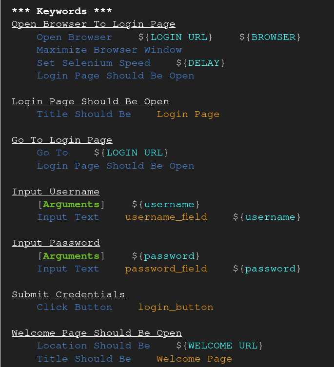
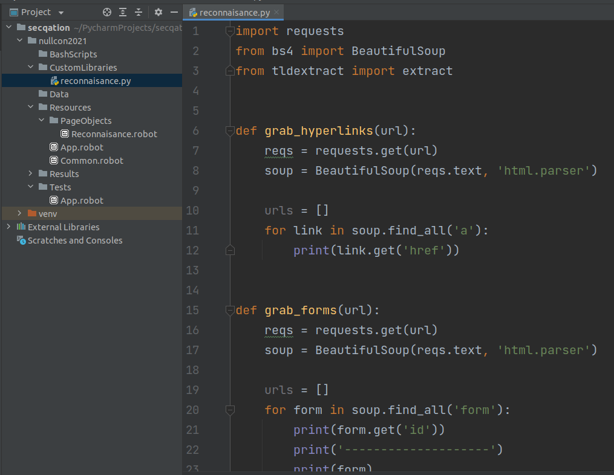
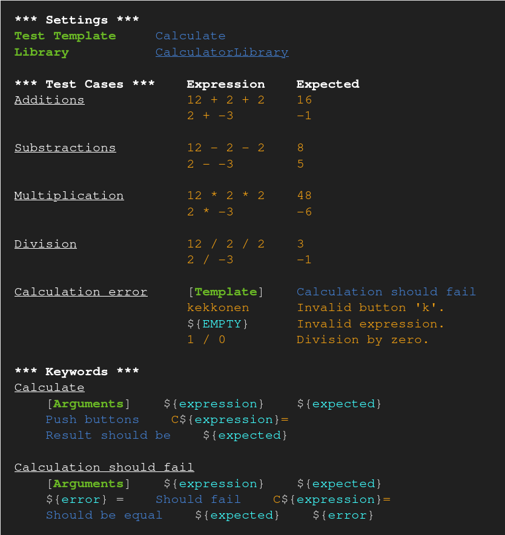
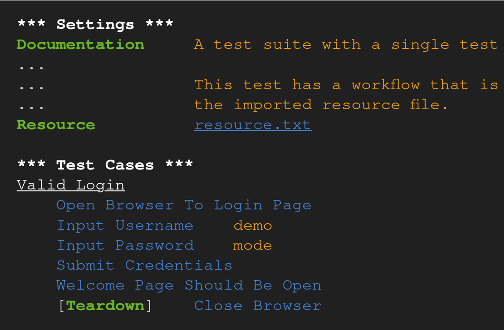
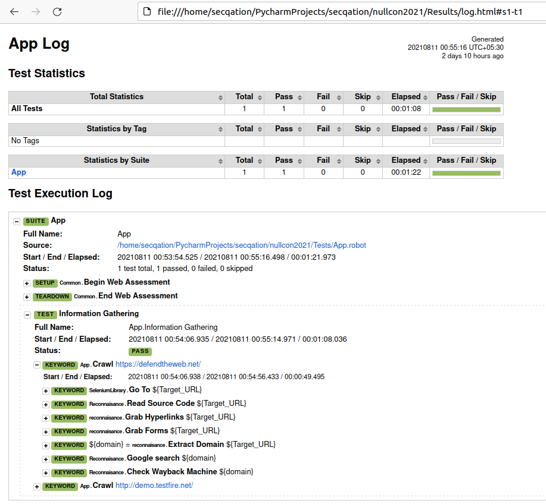

# Basic Elements of Robot Framework

1. Keyword
2. Library
3. Template
4. Test Case
5. Report and Log

## Keyword

Robot Framework has easy syntax, utilizing human-readable keywords.

## Library

Custom keywords can be created by defining methods in a Python file. Capabilities can be extended by libraries implemented with Python or Java.

## Template

For scenarios where test data varies, but test steps remain the same, use templates.

## Test Case

It's an abstraction layer, under which a series of automated test steps and output validations take place.

## Report and Log

One-stop place to view the test outputs and to analyze the overall application health.

