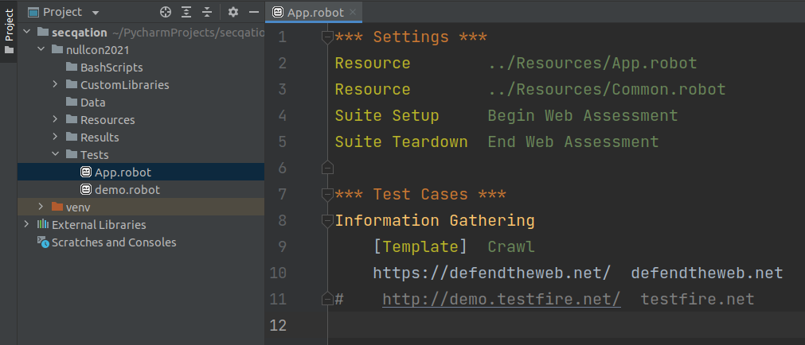

# Exercise: Structured Reconnaisance in <10 min

**Target Application**:
https://defendtheweb.net/

## Task #1

**Allotted Time:** 
10 minutes

1. Open a browser.
2. Navigate to [https://defendtheweb.net](https://defendtheweb.net).
3. Explore the target application and share what you've discovererd.

**Questions:**
* How much reconnaisance were you able to perform manually?
* Is it enough, or do you feel you need to spend more time to explore the target application?

## Task #2

**Allotted Time:** 
10 minutes

**Resource Folder Location:**
`/home/secqation/Desktop/NullconTraining2021/2-example/`

1. Create a new project in PyCharm
2. Copy `App.robot` file from `2-example/Tests/App.robot` into **Tests** folder
    
3. Copy `App.robot` file from `2-example/Resources/App.robot` into **Resources** folder
    
4. Copy `Common.robot` file from `2-example/Resources/Common.robot` into **Resources** folder
    
5. Copy `Crawl.robot` file from `2-example/Resources/PageObjects/Crawl.robot` into **Resources/PageObjects** folder
    
6. Copy `reconnaisance.py` file from `2-example/CustomLibraries/reconnaisance.py` into **CustomLibraries** folder
    
7. Trigger test execution:

    ```bash
    robot -d Results/ Tests/App.robot
    ```
    
8. Take a break until test execution is done
    
9. Open `log.html` in your browser window, to view the test results
10. Expand "**Print crawl status**" keyword
    
11. Expand desired keywords to view captured details
    
    
    
    
    

**Questions:**
* If you are asked to **repeat** the test steps, which method would you prefer? Would you prefer manual approach, or would you just re-trigger test execution while you comfortably sip a cup of coffee (or whatever it is you like).
* Do you see how the second approch could provide more information in less time, while also leaving you less exhausted, more refreshed and focused for the next step (which is to identify entry points)!