# mitmproxy: Intercepting API Requests & Responses

## Scenario

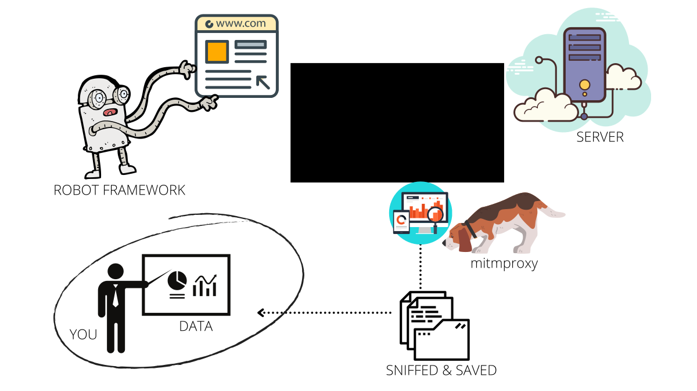

## Install mitmproxy

1. Install [mitmproxy](https://docs.mitmproxy.org/stable/overview-installation/) tool
2. Set LANG environment variable
    ```bash
    export LANG=en_US.UTF-8
    ```
    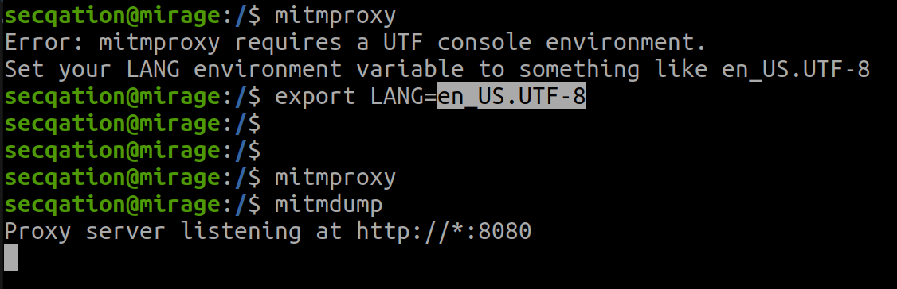

## Create Browser Profile

1. Ensure Firefox browser is installed
2. Run following command

    ```bash
    firefox -p
    ```
    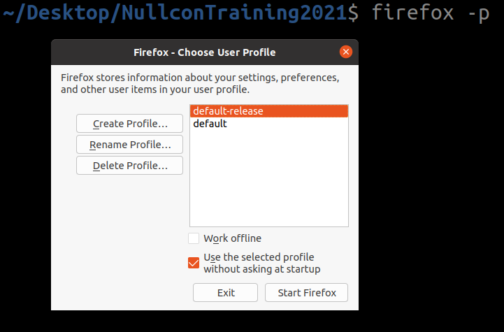
3. Click on "Create Profile" > "Next"
4. Enter a profile name (e.g. `SecQAtion`) 
5. Choose a folder path
6. Click on "Finish"
    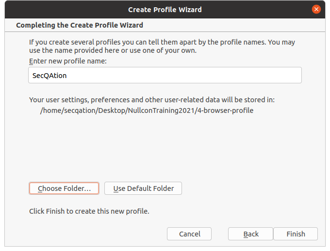
7. Select newly created profile
8. Uncheck `Use the selected profile without asking at startup` checkbox
    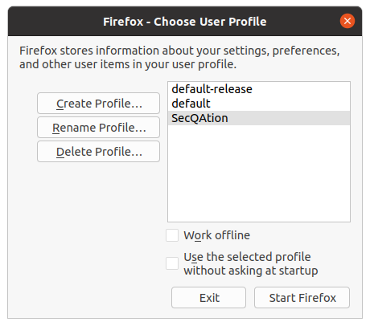
9. Click on "Start Firefox"
    

## Configure Browser Profile

### Enable Proxy

1. In the Firefox browser, go to "Settings" page
2. Search for "Network Settings"
    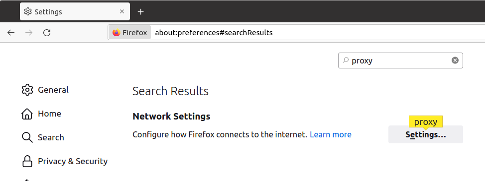
3. Click on "Settings..." button
4. Select "Manual proxy configuration" radio button
5. Enter `127.0.0.1` as HTTP Proxy value
6. Enter `8080` as HTTP Port value
7. Check "Also use this proxy for HTTPS" checkbox
    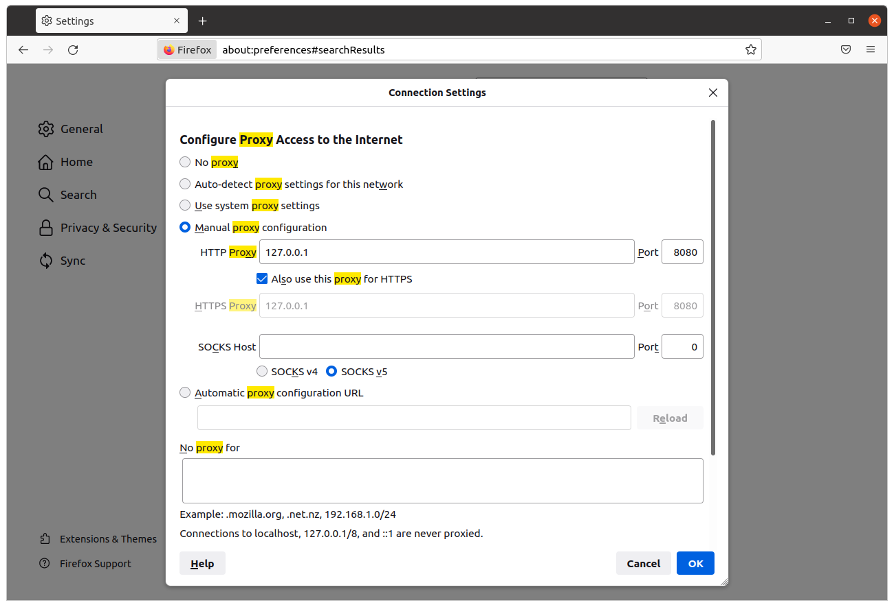

8. Click on "OK" button

### Install mitmproxy CA Certificate

Mitmproxy can decrypt encrypted traffic on the fly, as long as the client trusts mitmproxy’s built-in certificate authority. Usually this means that the mitmproxy CA certificate has to be installed on the client device.

Ref: https://docs.mitmproxy.org/stable/concepts-certificates/

9. Open a command prompt and type:
    ```bash
    mitmdump
    ```
    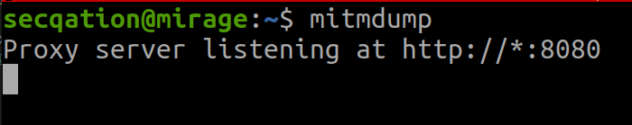
10. In the Firefox browser, navigate to [mitm.it](http://mitm.it/)
11. Download relevant certificate
    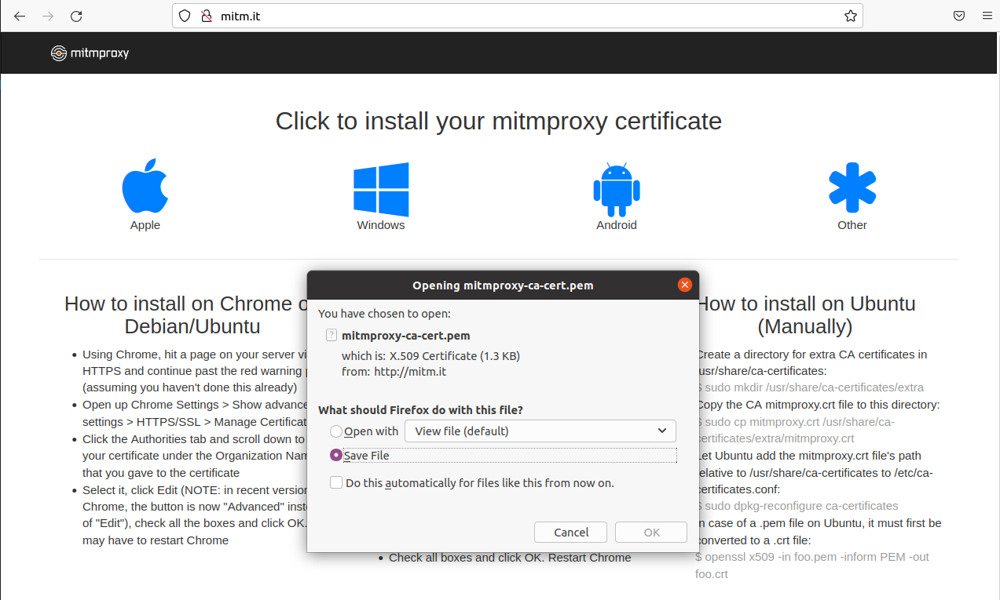
12. Follow certificate installation instructions

    ```bash
    $ cd ~/Downloads
    $ openssl x509 -in mitmproxy-ca-cert.pem -inform PEM -out mitmproxy-ca-cert.crt
    $ sudo mkdir /usr/share/ca-certificates/extra
    $ sudo cp mitmproxy-ca-cert.crt /usr/share/ca-certificates/extra/mitmproxy.crt
    $ sudo dpkg-reconfigure ca-certificates
    ```
    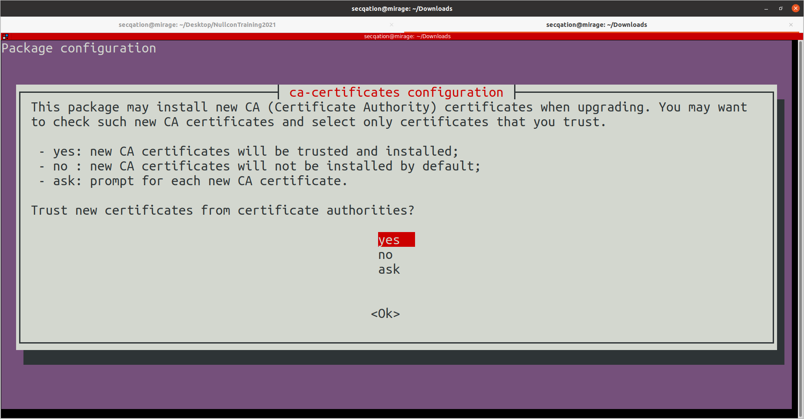
13. Select "yes" when asked to trust new certificates from certificate authorities
14. Select the newly added certificate by pressing **[TAB]** button,
    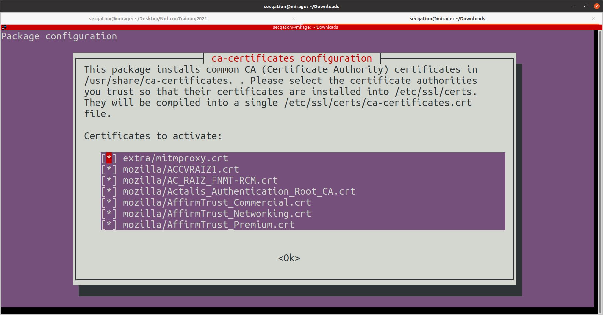
15. Press **[TAB]** and **[ENTER]** to select "Ok"
    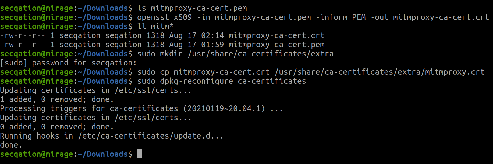
16. In Firefox browser, go to "Settings" page
17. Search for "Certificates"
    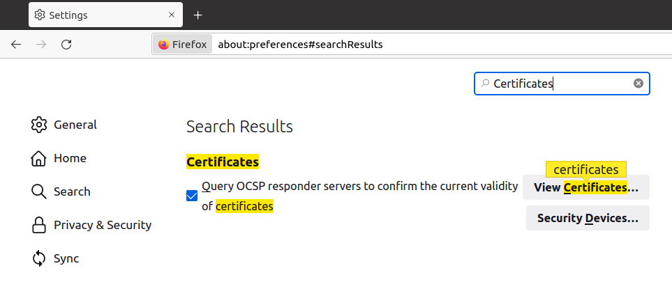
18. Click on "View Certificates"
19. Click on "Import"
    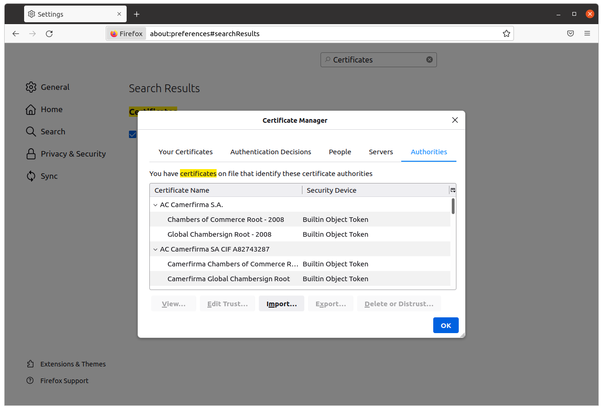
20. Choose the CA certificate "mitmproxy-ca-cert.crt"
21.  Select the checkbox labeled as "Trust this CA to identify websites."
    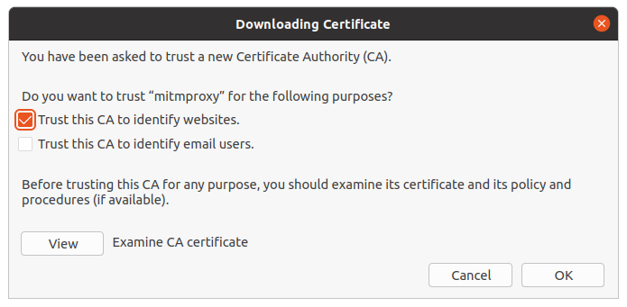
22. Click on "OK"

## Verify Setup

1. Open a terminal window by pressing **[CTRL]+[ALT]+T**
2. Start mitmproxy by running following command:
    ```bash
    mitmproxy
    ```
3. Open Firefox browser, and load the newly created browser profile (with proxy mode enabled)
4. Navigate to [https://defendtheweb.net/](https://defendtheweb.net/)
5. The secure website should load successfully
6. You should see the captured server requests and responses in mitmproxy screen
    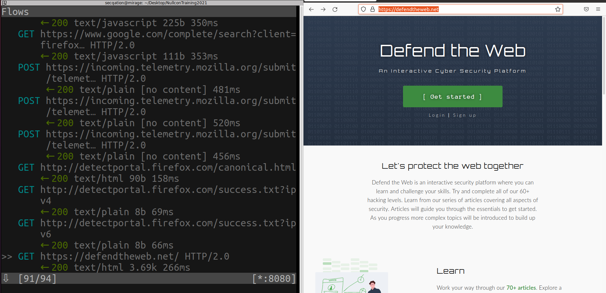
7. Your browser is configured and ready for use.

## What Next?

1. mitmproxy should intercept all server requests and responses while automated test cases get executed by the robot framework
2. Irrelevant browser traffic should be ignored
3. All of the captured traffic should be saved to a file
4. It should be possible to open the saved output file and analyze the intercepted traffic

## Prepare Bash Script

**init.sh**
```bash
mitmdump -p 8080 -w +traffic.mitm "! ~u firefox|ocsp|mozilla|googleapis" &
robot -d ~/PycharmProjects/secqation/nullcon2021/Results ~/PycharmProjects/secqation/nullcon2021/Tests/App.robot
pkill mitmdump
echo "Test Complete."
```

*Note:* You must update the **absolute path** to "Results" and "Tests" folder as per your own directory structure.

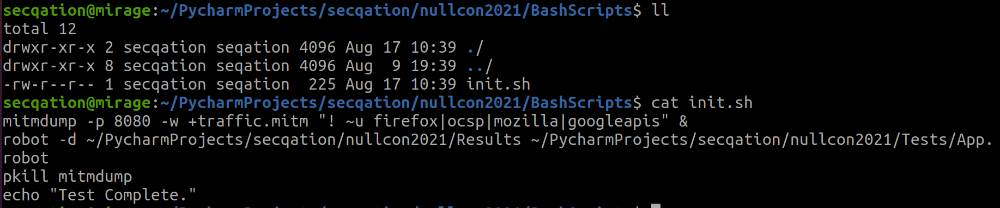

## Run Bash Script

Run following two commands, and take a short break:

```bash
chmod +x init.sh
./init.sh
```

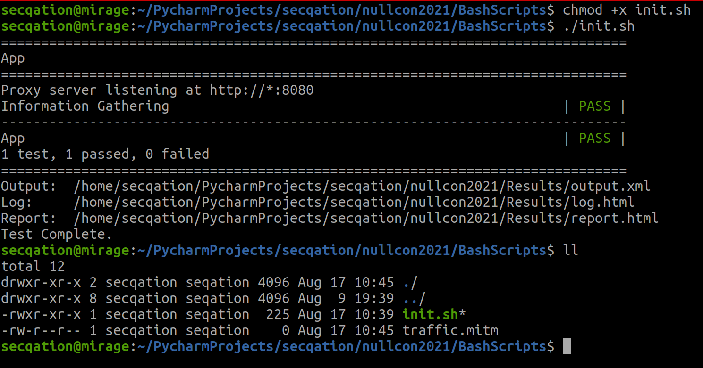

**Observation:**
* "traffic.mitm" file was created
* File size is 0, indicating no traffic was captured
* What went wrong?

## Update Browser Settings in Robot Framework

1. Locate the **folder** that stores data related to custom Firefox browser profile (that we created earlier), e.g., `/home/secqation/Desktop/NullconTraining2021/4-browser-profile`
2. In PyCharm, open "**Common.robot**" file under "**Resources**" folder
3. Update the value of **global variable** `${FIREFOX_PROXY_PROFILE}`. Set it as absolute path to Firefox profile directory.
    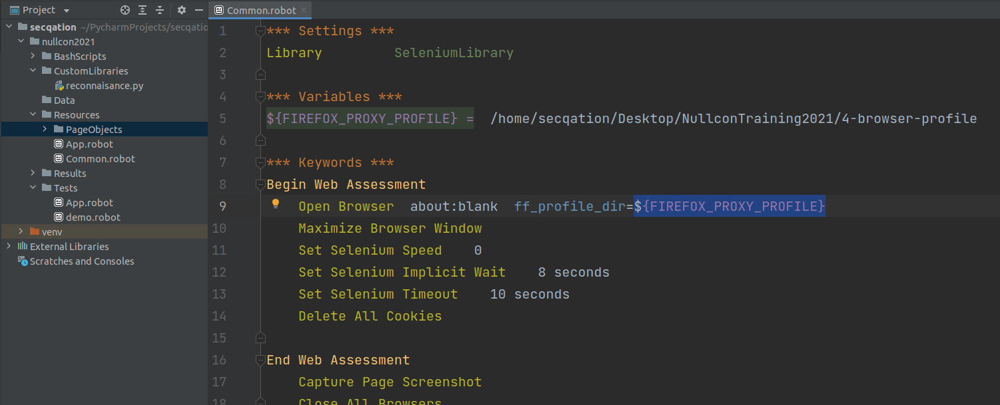

## Re-run Bash Script

1. Re-run the bash script

    ```bash
    ./init.sh
    ```
    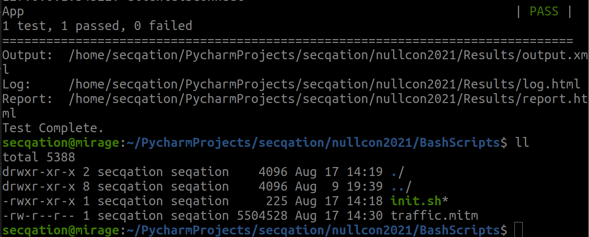

2. Notice that server traffic has been captured and saved successfully in the file `traffic.mitm`
3. Run following command to analyze the saved traffic
    ```bash
    mitmweb -r traffic.mitm
    ```
    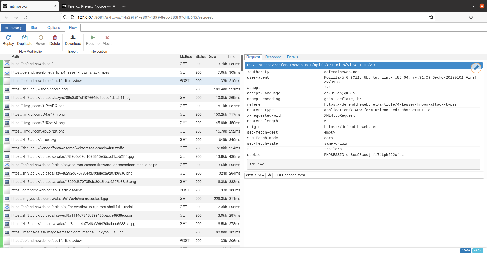
4. Also, access `log.html` file from Results folder, to view data scraped from the target website

    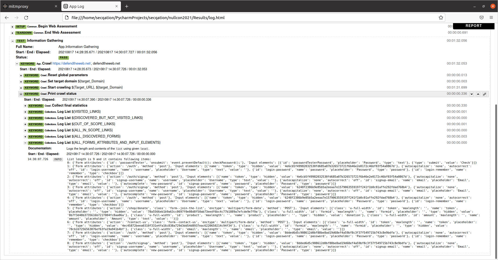

## Apply Human Intelligence Now

While the robots were at work, it was a break for you. With a refreshed mind, now is the time to look at all the gathered data and **identify potential attack vectors**.

The cuurrent data set can give you a good understanding about the target application.

After having a first look at the target application, if there's a need, the robot test cases can be enhanced further to automate the form filling process, or any other manual task, including reading emails from your email account or running commands in your bash shell, etc.

If you have clarity in your mind regarding the exact steps that you wish to perform, writing robot test cases is really a trivial process.
